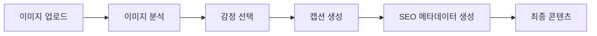

{
  "doc_meta": {
    "id": "AI-001",
    "version": "2025-01-14",
    "owners": ["pablo"],
    "scope": ["ai", "openai", "gpt-4o"],
    "related": ["API-001", "COMP-001"]
  }
}

# StayPost AI 통합 가이드

이 문서는 StayPost 프로젝트의 AI 서비스 통합 방법과 구현 세부사항을 설명합니다.

## 📋 목차
- [개요](#개요)
- [AI 서비스 아키텍처](#ai-서비스-아키텍처)
- [OpenAI GPT-4o 통합](#openai-gpt-4o-통합)
- [프롬프트 엔지니어링](#프롬프트-엔지니어링)
- [이미지 분석](#이미지-분석)
- [에러 처리](#에러-처리)
- [성능 최적화](#성능-최적화)
- [비용 관리](#비용-관리)

## 🏗️ 아키텍처
<!-- 아키텍처 관련 내용 -->

## 🔌 API
<!-- API 관련 내용 -->

## 🗄️ 데이터베이스
<!-- 데이터베이스 관련 내용 -->

## 🎨 컴포넌트
<!-- 컴포넌트 관련 내용 -->

## 🔄 상태 관리
<!-- 상태 관리 관련 내용 -->

## 🚀 배포
<!-- 배포 관련 내용 -->

## 🐛 문제 해결
<!-- 문제 해결 관련 내용 -->

## 🔮 향후 계획
<!-- 향후 계획 관련 내용 -->

## 개요

StayPost는 OpenAI GPT-4o를 핵심 AI 서비스로 사용하여 감정 기반 캡션 생성과 이미지 분석을 수행합니다. 이를 통해 사용자가 업로드한 이미지에 맞는 개인화된 SNS 콘텐츠를 자동으로 생성합니다.

## AI 서비스 아키텍처

### 전체 AI 플로우



### AI 서비스 구성

```
AI Services
├── OpenAI GPT-4o
│   ├── 캡션 생성
│   ├── 이미지 분석
│   └── SEO 메타데이터 생성
├── ClipDrop API (선택사항)
│   └── 이미지 리터칭
└── 로컬 이미지 처리
    ├── 이미지 압축
    └── 포맷 변환
```

## OpenAI GPT-4o 통합

### 기본 설정

```typescript
// lib/openai.ts
import OpenAI from 'openai';

const openai = new OpenAI({
  apiKey: process.env.OPENAI_API_KEY,
  dangerouslyAllowBrowser: false // 브라우저에서 직접 호출 방지
});

export default openai;
```

### 캡션 생성 함수

```typescript
// utils/generateCaption.ts
export async function generateCaption(params: {
  emotion: string;
  templateId: string;
  storeName: string;
  placeDesc?: string;
}): Promise<{
  hook: string;
  caption: string;
  hashtags: string[];
}> {
  const { emotion, templateId, storeName, placeDesc } = params;
  
  const prompt = buildCaptionPrompt({
    emotion,
    templateId,
    storeName,
    placeDesc
  });

  try {
    const completion = await openai.chat.completions.create({
      model: "gpt-4o",
      messages: [
        {
          role: "system",
          content: "당신은 숙박업소 SNS 마케팅 전문가입니다. 감정적이고 매력적인 캡션을 생성해주세요."
        },
        {
          role: "user",
          content: prompt
        }
      ],
      temperature: 0.7,
      max_tokens: 500
    });

    const response = completion.choices[0]?.message?.content;
    return parseCaptionResponse(response);
  } catch (error) {
    console.error('OpenAI API Error:', error);
    throw new Error('캡션 생성에 실패했습니다.');
  }
}
```

### 이미지 분석 함수

```typescript
// utils/generateImageMeta.ts
export async function generateImageMeta(imageBase64: string): Promise<{
  main_features: string[];
  view_type: string;
  emotions: string[];
  hashtags: string[];
}> {
  try {
    const completion = await openai.chat.completions.create({
      model: "gpt-4o",
      messages: [
        {
          role: "system",
          content: "이미지를 분석하여 숙박업소 마케팅에 필요한 정보를 추출해주세요."
        },
        {
          role: "user",
          content: [
            {
              type: "text",
              text: "이 숙박업소 이미지를 분석하여 다음 정보를 제공해주세요: 주요 특징, 뷰 타입, 감정적 분위기, 해시태그"
            },
            {
              type: "image_url",
              image_url: {
                url: `data:image/jpeg;base64,${imageBase64}`
              }
            }
          ]
        }
      ],
      temperature: 0.3,
      max_tokens: 300
    });

    const response = completion.choices[0]?.message?.content;
    return parseImageMetaResponse(response);
  } catch (error) {
    console.error('Image Analysis Error:', error);
    throw new Error('이미지 분석에 실패했습니다.');
  }
}
```

## 프롬프트 엔지니어링

### 캡션 생성 프롬프트 템플릿

```typescript
// utils/promptTemplates.ts
export function buildCaptionPrompt(params: {
  emotion: string;
  templateId: string;
  storeName: string;
  placeDesc?: string;
}): string {
  const { emotion, templateId, storeName, placeDesc } = params;
  
  const emotionContext = getEmotionContext(emotion);
  const templateStyle = getTemplateStyle(templateId);
  
  return `
숙박업소 "${storeName}"의 SNS 캡션을 생성해주세요.

감정: ${emotion}
${emotionContext}

스타일: ${templateStyle}

${placeDesc ? `장소 설명: ${placeDesc}` : ''}

요구사항:
1. 감정에 맞는 톤앤매너로 작성
2. 2-3문장으로 구성
3. 이모지 1-2개 포함
4. 해시태그 3-5개 생성

출력 형식:
훅: [매력적인 첫 문장]
캡션: [본문 내용]
해시태그: [해시태그 목록]
`;
}

function getEmotionContext(emotion: string): string {
  const contexts = {
    '설렘': '기대감과 설렘을 느낄 수 있는 분위기',
    '평온': '차분하고 평화로운 분위기',
    '즐거움': '활기차고 즐거운 분위기',
    '로맨틱': '로맨틱하고 아름다운 분위기',
    '힐링': '편안하고 힐링되는 분위기'
  };
  return contexts[emotion] || contexts['평온'];
}

function getTemplateStyle(templateId: string): string {
  const styles = {
    'default_universal': '일반적인 SNS 스타일',
    'ocean_sunset': '오션 선셋 분위기',
    'luxury_pool': '럭셔리 풀 분위기',
    'cafe_cozy': '카페 코지 분위기'
  };
  return styles[templateId] || styles['default_universal'];
}
```

### 응답 파싱 함수

```typescript
// utils/parseCaptionResponse.ts
export function parseCaptionResponse(response: string): {
  hook: string;
  caption: string;
  hashtags: string[];
} {
  try {
    // 정규식을 사용하여 응답 파싱
    const hookMatch = response.match(/훅:\s*(.+)/);
    const captionMatch = response.match(/캡션:\s*(.+)/);
    const hashtagsMatch = response.match(/해시태그:\s*(.+)/);

    const hook = hookMatch?.[1]?.trim() || '';
    const caption = captionMatch?.[1]?.trim() || '';
    const hashtagsText = hashtagsMatch?.[1]?.trim() || '';

    // 해시태그 파싱
    const hashtags = hashtagsText
      .split(/[,\s]+/)
      .map(tag => tag.trim())
      .filter(tag => tag.startsWith('#'))
      .slice(0, 5);

    return {
      hook: hook || caption.split('.')[0] + '.',
      caption: caption || response,
      hashtags: hashtags.length > 0 ? hashtags : ['#숙박업소', '#여행', '#힐링']
    };
  } catch (error) {
    console.error('Response parsing error:', error);
    return {
      hook: response.split('.')[0] + '.',
      caption: response,
      hashtags: ['#숙박업소', '#여행', '#힐링']
    };
  }
}
```

## 이미지 분석

### 이미지 전처리

```typescript
// utils/imageProcessing.ts
export async function preprocessImage(file: File): Promise<string> {
  return new Promise((resolve, reject) => {
    const canvas = document.createElement('canvas');
    const ctx = canvas.getContext('2d');
    const img = new Image();

    img.onload = () => {
      // 이미지 크기 조정 (최대 1024px)
      const maxSize = 1024;
      let { width, height } = img;
      
      if (width > height) {
        if (width > maxSize) {
          height = (height * maxSize) / width;
          width = maxSize;
        }
      } else {
        if (height > maxSize) {
          width = (width * maxSize) / height;
          height = maxSize;
        }
      }

      canvas.width = width;
      canvas.height = height;
      
      // 이미지 그리기
      ctx?.drawImage(img, 0, 0, width, height);
      
      // JPEG로 변환 (품질 0.8)
      const dataUrl = canvas.toDataURL('image/jpeg', 0.8);
      const base64 = dataUrl.split(',')[1];
      
      resolve(base64);
    };

    img.onerror = reject;
    img.src = URL.createObjectURL(file);
  });
}
```

### 이미지 메타데이터 파싱

```typescript
// utils/parseImageMetaResponse.ts
export function parseImageMetaResponse(response: string): {
  main_features: string[];
  view_type: string;
  emotions: string[];
  hashtags: string[];
} {
  try {
    // JSON 형식으로 응답을 파싱
    const lines = response.split('\n');
    const result = {
      main_features: [],
      view_type: '',
      emotions: [],
      hashtags: []
    };

    for (const line of lines) {
      if (line.includes('주요 특징:')) {
        result.main_features = line.split(':')[1]?.split(',').map(f => f.trim()) || [];
      } else if (line.includes('뷰 타입:')) {
        result.view_type = line.split(':')[1]?.trim() || '';
      } else if (line.includes('감정:')) {
        result.emotions = line.split(':')[1]?.split(',').map(e => e.trim()) || [];
      } else if (line.includes('해시태그:')) {
        result.hashtags = line.split(':')[1]?.split(',').map(h => h.trim()) || [];
      }
    }

    return result;
  } catch (error) {
    console.error('Image meta parsing error:', error);
    return {
      main_features: ['숙박업소'],
      view_type: '일반',
      emotions: ['편안함'],
      hashtags: ['#숙박업소', '#여행']
    };
  }
}
```

## 에러 처리

### AI 서비스 에러 처리

```typescript
// utils/aiErrorHandler.ts
export class AIError extends Error {
  constructor(
    message: string,
    public code: string,
    public retryable: boolean = false
  ) {
    super(message);
    this.name = 'AIError';
  }
}

export function handleAIError(error: any): AIError {
  if (error instanceof AIError) {
    return error;
  }

  // OpenAI API 에러 처리
  if (error?.response?.status) {
    switch (error.response.status) {
      case 401:
        return new AIError('API 키가 유효하지 않습니다.', 'INVALID_API_KEY');
      case 429:
        return new AIError('요청 한도를 초과했습니다. 잠시 후 다시 시도해주세요.', 'RATE_LIMIT', true);
      case 500:
        return new AIError('AI 서비스에 일시적인 문제가 발생했습니다.', 'AI_SERVICE_ERROR', true);
      default:
        return new AIError('AI 서비스 호출 중 오류가 발생했습니다.', 'UNKNOWN_ERROR');
    }
  }

  // 네트워크 에러
  if (error.name === 'TypeError' && error.message.includes('fetch')) {
    return new AIError('네트워크 연결을 확인해주세요.', 'NETWORK_ERROR', true);
  }

  return new AIError('알 수 없는 오류가 발생했습니다.', 'UNKNOWN_ERROR');
}
```

### 재시도 로직

```typescript
// utils/retry.ts
export async function retryWithBackoff<T>(
  fn: () => Promise<T>,
  maxRetries: number = 3,
  baseDelay: number = 1000
): Promise<T> {
  let lastError: Error;

  for (let attempt = 0; attempt <= maxRetries; attempt++) {
    try {
      return await fn();
    } catch (error) {
      lastError = error as Error;
      
      if (attempt === maxRetries) {
        throw lastError;
      }

      // 재시도 가능한 에러인지 확인
      if (error instanceof AIError && !error.retryable) {
        throw error;
      }

      // 지수 백오프
      const delay = baseDelay * Math.pow(2, attempt);
      await new Promise(resolve => setTimeout(resolve, delay));
    }
  }

  throw lastError!;
}
```

## 성능 최적화

### 캐싱 전략

```typescript
// utils/aiCache.ts
class AICache {
  private cache = new Map<string, { data: any; timestamp: number }>();
  private readonly TTL = 5 * 60 * 1000; // 5분

  set(key: string, data: any): void {
    this.cache.set(key, {
      data,
      timestamp: Date.now()
    });
  }

  get(key: string): any | null {
    const item = this.cache.get(key);
    if (!item) return null;

    if (Date.now() - item.timestamp > this.TTL) {
      this.cache.delete(key);
      return null;
    }

    return item.data;
  }

  clear(): void {
    this.cache.clear();
  }
}

export const aiCache = new AICache();
```

### 배치 처리

```typescript
// utils/batchProcessor.ts
export class BatchProcessor {
  private queue: Array<() => Promise<any>> = [];
  private processing = false;
  private batchSize = 5;
  private delay = 1000; // 1초 간격

  async add<T>(task: () => Promise<T>): Promise<T> {
    return new Promise((resolve, reject) => {
      this.queue.push(async () => {
        try {
          const result = await task();
          resolve(result);
          return result;
        } catch (error) {
          reject(error);
          throw error;
        }
      });

      if (!this.processing) {
        this.process();
      }
    });
  }

  private async process(): Promise<void> {
    this.processing = true;

    while (this.queue.length > 0) {
      const batch = this.queue.splice(0, this.batchSize);
      
      try {
        await Promise.all(batch.map(task => task()));
      } catch (error) {
        console.error('Batch processing error:', error);
      }

      if (this.queue.length > 0) {
        await new Promise(resolve => setTimeout(resolve, this.delay));
      }
    }

    this.processing = false;
  }
}

export const batchProcessor = new BatchProcessor();
```

## 비용 관리

### 토큰 사용량 모니터링

```typescript
// utils/tokenMonitor.ts
export class TokenMonitor {
  private usage = {
    totalTokens: 0,
    totalCost: 0,
    requests: 0
  };

  recordUsage(tokens: number, model: string): void {
    this.usage.totalTokens += tokens;
    this.usage.requests += 1;
    
    // GPT-4o 비용 계산 (예시)
    const costPer1kTokens = 0.005; // 실제 비용으로 수정 필요
    this.usage.totalCost += (tokens / 1000) * costPer1kTokens;

    // 로깅
    console.log(`Token usage: ${tokens}, Total: ${this.usage.totalTokens}, Cost: $${this.usage.totalCost.toFixed(4)}`);
  }

  getUsage() {
    return { ...this.usage };
  }

  reset(): void {
    this.usage = {
      totalTokens: 0,
      totalCost: 0,
      requests: 0
    };
  }
}

export const tokenMonitor = new TokenMonitor();
```

### 비용 제한 설정

```typescript
// utils/costLimiter.ts
export class CostLimiter {
  private dailyCost = 0;
  private lastReset = new Date().toDateString();
  private readonly dailyLimit = 10; // $10 일일 한도

  canMakeRequest(estimatedCost: number): boolean {
    this.checkDailyReset();
    
    if (this.dailyCost + estimatedCost > this.dailyLimit) {
      return false;
    }
    
    return true;
  }

  recordCost(cost: number): void {
    this.checkDailyReset();
    this.dailyCost += cost;
  }

  private checkDailyReset(): void {
    const today = new Date().toDateString();
    if (today !== this.lastReset) {
      this.dailyCost = 0;
      this.lastReset = today;
    }
  }

  getDailyUsage(): { cost: number; limit: number; remaining: number } {
    this.checkDailyReset();
    return {
      cost: this.dailyCost,
      limit: this.dailyLimit,
      remaining: this.dailyLimit - this.dailyCost
    };
  }
}

export const costLimiter = new CostLimiter();
```

## 🏛️ ADR (Architecture Decision Records)

### ADR-001: OpenAI GPT-4o 선택
**날짜**: 2025-01-14  
**상태**: 승인됨  
**컨텍스트**: 감정 기반 캡션 생성을 위한 AI 모델 선택  
**결정**: GPT-4o의 높은 품질과 빠른 응답 속도로 선택  
**결과**: 안정적이고 품질 높은 캡션 생성

### ADR-002: Edge Functions에서 AI 처리
**날짜**: 2025-01-14  
**상태**: 승인됨  
**컨텍스트**: AI API 호출 위치 선택  
**결정**: Supabase Edge Functions에서 AI API 호출하여 보안 강화  
**결과**: API 키 보안 및 성능 최적화

## 📋 Changelog

| 날짜 | 버전 | 요약 |
|------|------|------|
| 2025-01-14 | v1.0.0 | AI 통합 가이드 초기 작성 |
| 2025-01-14 | v1.1.0 | 프롬프트 엔지니어링 및 에러 처리 추가 |
| 2025-01-14 | v1.2.0 | 성능 최적화 및 비용 관리 추가 |
