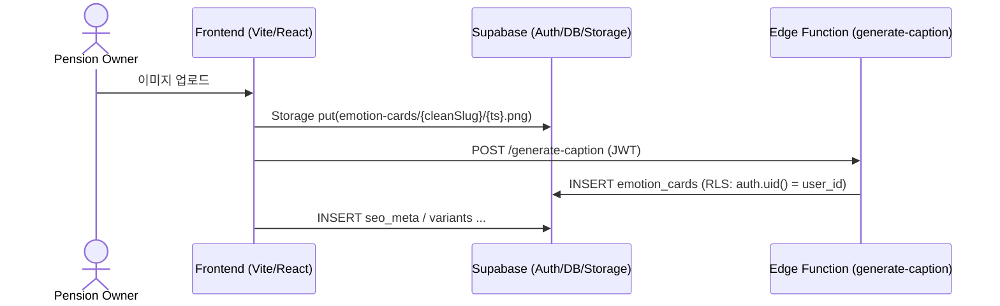

{
  "doc_meta": {
    "id": "ARCH-001",
    "version": "2025-08-14",
    "owners": ["pablo"],
    "scope": ["frontend","edge-functions","supabase"],
    "status": "active",
    "related": ["DB-001","API-001","COMP-001"]
  }
}

# StayPost 시스템 아키텍처

## 📋 개요

StayPost는 감정 기반 펜션/숙박업소 SNS 콘텐츠 생성기입니다. 사용자가 업로드한 이미지에 감정과 스타일을 선택하면 AI가 자동으로 캡션을 생성하고, Canvas를 통해 미리보기를 제공하며, SEO 메타데이터와 함께 최종 콘텐츠를 다운로드할 수 있는 웹 애플리케이션입니다.

## 🏗️ 전체 시스템 아키텍처

```mermaid
flowchart LR
  FE[Frontend (React/TS)] <--> SB[(Supabase Auth/DB/Storage)]
  FE <--> OF[Supabase Edge Functions]
  OF --> OpenAI[(OpenAI)]
  OF --> ClipDrop[(ClipDrop)]
  FE --> Netlify[(Netlify Hosting)]
```

## 🔄 핵심 데이터 플로우



## 🎯 핵심 기술 스택

### Frontend
- **React 18** + **TypeScript**: 메인 UI 프레임워크
- **Vite**: 빌드 도구 및 개발 서버
- **Tailwind CSS**: 스타일링
- **React Router**: 클라이언트 사이드 라우팅
- **Lucide React**: 아이콘 라이브러리

### Backend
- **Express.js**: API 서버
- **Supabase**: 인증, 데이터베이스, 스토리지
- **OpenAI GPT-4o**: AI 캡션 생성
- **ClipDrop API**: 이미지 리터칭

### Infrastructure
- **Supabase Edge Functions**: 서버리스 함수
- **PostgreSQL**: 메인 데이터베이스
- **Supabase Storage**: 이미지 저장소

## 🔄 데이터 플로우

### 1. 사용자 인증 플로우
```
1. 사용자 접속 → LoginScreen 렌더링
2. Google OAuth 로그인 → Supabase Auth
3. 인증 성공 → StepWizard 메인 화면
4. 세션 관리 → useAuth 훅으로 전역 상태 관리
```

### 2. 콘텐츠 생성 플로우
```
Step 1: 이미지 업로드
├── 파일 선택 → 미리보기 생성
├── 이미지 설명 입력 (선택사항)
└── 스토어 정보 설정

Step 2: 감정 & 스타일 선택
├── 감정 선택 (설렘, 평온, 즐거움, 로맨틱, 힐링)
├── 템플릿 선택 (기본, 오션 선셋, 럭셔리 풀, 카페 코지)
└── AI 캡션 생성 (OpenAI GPT-4o)

Step 3: Canvas 미리보기
├── 이미지 + 캡션 조합
├── 스타일 프리셋 적용
└── 실시간 미리보기

Step 4: SEO 메타데이터
├── 제목, 키워드, 해시태그 생성
├── 슬러그 생성
└── SEO 최적화

Step 5: 다운로드 & 공유
├── 최종 이미지 생성
├── 데이터베이스 저장
└── 다운로드/공유 기능
```

### 3. AI 처리 플로우
```
1. 사용자 입력 (감정 + 템플릿 + 이미지 설명)
2. OpenAI GPT-4o API 호출
3. 프롬프트 엔지니어링으로 최적화된 캡션 생성
4. 결과 반환 (캡션 + 해시태그)
5. 에러 처리 및 fallback 메시지
```

## 🗂️ 주요 컴포넌트 구조

### Frontend 컴포넌트 계층
```
App.tsx
├── LoginScreen (인증)
└── Router
    ├── StepWizard (메인 워크플로우)
    │   ├── Step1_Upload (이미지 업로드)
    │   ├── Step2_Emotion (감정 선택 & AI 생성)
    │   ├── Step3_Canvas (미리보기)
    │   ├── Step4_Meta (SEO 설정)
    │   └── Step5_Export (다운로드)
    ├── ReservationPage (예약 페이지)
    └── CompletePage (완료 페이지)
```

### 핵심 훅 (Hooks)
- **useAuth**: 인증 상태 관리
- **useGenerateCaptions**: AI 캡션 생성
- **useGenerateImageMeta**: 이미지 메타데이터 생성
- **useGenerateStayPostContent**: 전체 콘텐츠 생성

### 유틸리티 함수
- **generateCaption**: 캡션 생성 로직
- **generateSeoMeta**: SEO 메타데이터 생성
- **exportEmotionCard**: 최종 이미지 내보내기
- **saveEmotionCard**: 데이터베이스 저장

## 🗄️ 데이터베이스 스키마

### 주요 테이블

#### 1. store_profiles
```sql
- id (uuid, PK)
- slug (text, unique)
- store_name (text)
- style_presets (jsonb)
- intro (text)
- created_at (timestamp)
```

#### 2. emotion_cards
```sql
- id (uuid, PK)
- image_url (text)
- caption (text)
- emotion (text)
- template_id (text)
- store_slug (text, FK)
- seo_title (text)
- seo_keywords (text[])
- seo_hashtags (text[])
- created_at (timestamp)
```

#### 3. reservations
```sql
- id (uuid, PK)
- store_slug (text, FK)
- date (date)
- time (time)
- person_count (integer)
- name (text)
- phone (text)
- request (text)
- created_at (timestamp)
```

## 🔧 API 엔드포인트

### Express 서버 (localhost:5001)
- `POST /api/caption`: 이미지 기반 캡션 생성
- `POST /api/relight`: 이미지 리터칭 (ClipDrop)
- `GET /api/health`: 헬스 체크

### Supabase Edge Functions
- `POST /functions/v1/generate-caption`: AI 캡션 생성
- `POST /functions/v1/generate-image-meta`: 이미지 메타데이터 생성
- `POST /functions/v1/create-store`: 스토어 생성
- `GET /functions/v1/check-slug-availability`: 슬러그 중복 확인

## 🔐 보안 및 인증

### 권한/인증 한눈표
| 기능 | 권한 | RLS 정책 |
|------|------|----------|
| 공개 읽기 | `/:slug/complete` | 없음 (공개) |
| 콘텐츠 생성/저장 | 인증 필요 | `auth.uid() = user_id` |
| 스토어 관리 | 인증 필요 | `auth.uid() = user_id` |
| 개인 데이터 접근 | 소유자 권한 | `auth.uid() = user_id` |

### 핵심 RLS 정책
```sql
-- emotion_cards 테이블 INSERT 정책
create policy "insert_own_cards"
on public.emotion_cards
for insert to authenticated
with check (auth.uid() = user_id);

-- store_profiles 테이블 SELECT 정책
create policy "select_own_stores"
on public.store_profiles
for select to authenticated
using (auth.uid() = user_id);
```

### 인증 시스템
- **Supabase Auth**: Google OAuth 기반 인증
- **Row Level Security (RLS)**: 데이터베이스 레벨 보안
- **JWT 토큰**: 세션 관리

## 📁 스토리지 키 규칙

### Supabase Storage 규칙
```markdown
Storage key rule:
- bucket: emotion-cards
- key: emotion-cards/{cleanSlug}/{timestamp}.png
- ASCII only (slug는 사전 정규화)
- 파일명: {timestamp}_{random}.png
- 경로: emotion-cards/{storeSlug}/{filename}
```

### 키 생성 규칙
- **cleanSlug**: 영문, 숫자, 하이픈만 허용
- **timestamp**: ISO 8601 형식 (YYYY-MM-DDTHH:mm:ss.sssZ)
- **파일 확장자**: .png, .jpg, .jpeg만 허용
- **최대 파일 크기**: 10MB

## 🚀 배포 아키텍처

### 개발 환경
```
Frontend: Vite Dev Server (localhost:5173)
Backend: Express Server (localhost:5001)
Database: Supabase Local/Cloud
```

### 프로덕션 환경
```
Frontend: Netlify (정적 호스팅)
Backend: Supabase Edge Functions
Database: Supabase Cloud
Storage: Supabase Storage
```

## 📊 성능 최적화

### 프론트엔드
- **React.memo**: 불필요한 리렌더링 방지
- **Lazy Loading**: 컴포넌트 지연 로딩
- **Image Optimization**: 이미지 압축 및 최적화

### 백엔드
- **Edge Functions**: 서버리스 아키텍처
- **Connection Pooling**: 데이터베이스 연결 최적화
- **Caching**: Redis 캐싱 (향후 도입 예정)

## 🔄 상태 관리

### 전역 상태
- **useAuth**: 인증 상태
- **StepWizard**: 단계별 데이터 공유
- **Local Storage**: 사용자 설정 저장

### 컴포넌트 상태
- **useState**: 로컬 컴포넌트 상태
- **useEffect**: 사이드 이펙트 관리
- **Custom Hooks**: 재사용 가능한 로직

## 🧪 테스트 전략

### 테스트 계층
- **Unit Tests**: 유틸리티 함수, 훅
- **Integration Tests**: API 엔드포인트
- **E2E Tests**: 사용자 워크플로우

### 테스트 도구
- **Jest**: 테스트 러너
- **React Testing Library**: 컴포넌트 테스트
- **Cypress**: E2E 테스트 (향후 도입 예정)

## 🔮 향후 확장 계획

### 기능 확장
- **멀티 이미지 지원**: 여러 이미지 동시 처리
- **템플릿 커스터마이징**: 사용자 정의 템플릿
- **소셜 미디어 연동**: 자동 포스팅

### 기술 개선
- **PWA 지원**: 오프라인 기능
- **실시간 협업**: 다중 사용자 편집
- **AI 모델 업그레이드**: 더 정교한 캡션 생성

## 📝 개발 가이드라인

### 코드 스타일
- **TypeScript**: 엄격한 타입 체크
- **ESLint**: 코드 품질 관리
- **Prettier**: 코드 포맷팅

### Git 워크플로우
- **Feature Branches**: 기능별 브랜치
- **Conventional Commits**: 표준 커밋 메시지
- **Pull Request**: 코드 리뷰 필수

## 🏛️ ADR (Architecture Decision Records)

### ADR-001: Express + Edge Functions 분리
**날짜**: 2025-08-14  
**상태**: 승인됨  
**컨텍스트**: 개발 환경에서는 빠른 반복을 위해 Express 서버를 사용하고, 프로덕션에서는 서버리스 아키텍처로 전환  
**결정**: 개발/운영 환경 분리로 개발 속도와 운영 안정성 모두 확보  
**결과**: 개발 시 빠른 API 테스트, 운영 시 비용 효율성 달성

### ADR-002: Supabase Auth + RLS
**날짜**: 2025-08-14  
**상태**: 승인됨  
**컨텍스트**: 사용자 인증과 데이터 보안을 위한 솔루션 선택  
**결정**: Supabase Auth로 인증, RLS로 데이터베이스 레벨 보안 구현  
**결과**: 개발 복잡도 감소, 보안성 향상

### ADR-003: OpenAI GPT-4o 선택
**날짜**: 2025-08-14  
**상태**: 승인됨  
**컨텍스트**: 감정 기반 캡션 생성을 위한 AI 모델 선택  
**결정**: GPT-4o의 높은 품질과 빠른 응답 속도로 선택  
**결과**: 사용자 만족도 향상, 안정적인 AI 서비스 제공

## 📋 Changelog

### v1.0.0 (2025-08-14)
- ✅ 초기 아키텍처 설계 완료
- ✅ Supabase 기반 인증/데이터베이스 구축
- ✅ React + TypeScript 프론트엔드 구현
- ✅ OpenAI GPT-4o 연동
- ✅ 기본 워크플로우 구현

### v1.1.0 (예정)
- 🔄 Edge Functions 최적화
- 🔄 이미지 처리 성능 개선
- 🔄 SEO 메타데이터 자동화

### v1.2.0 (예정)
- 🔄 멀티 이미지 지원
- 🔄 템플릿 커스터마이징
- 🔄 소셜 미디어 연동

---

이 문서는 StayPost 시스템의 전체적인 아키텍처를 이해하는 데 도움이 되며, 새로운 개발자가 프로젝트에 참여할 때 빠르게 시스템을 파악할 수 있도록 작성되었습니다.
