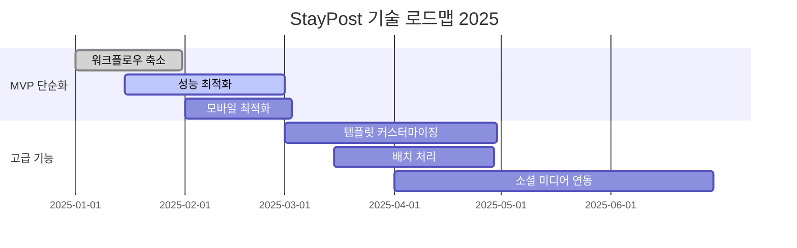
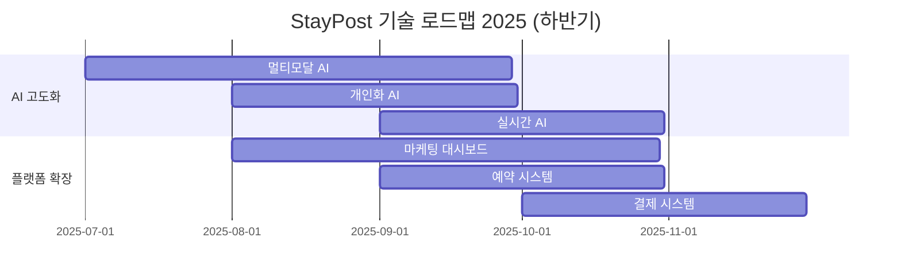

{
  "doc_meta": {
    "id": "FUTURE-001",
    "version": "2025-01-14",
    "owners": ["pablo"],
    "scope": ["roadmap", "planning", "features"],
    "related": ["ARCH-001", "MVP-001"]
  }
}

# StayPost 향후 계획

이 문서는 StayPost 프로젝트의 향후 개발 계획과 로드맵을 설명합니다.

## 📋 목차
- [개요](#개요)
- [단기 계획 (1-3개월)](#단기-계획-1-3개월)
- [중기 계획 (3-6개월)](#중기-계획-3-6개월)
- [장기 계획 (6-12개월)](#장기-계획-6-12개월)
- [기술 로드맵](#기술-로드맵)
- [비즈니스 목표](#비즈니스-목표)
- [위험 요소](#위험-요소)
- [성공 지표](#성공-지표)

## 🏗️ 아키텍처
<!-- 아키텍처 관련 내용 -->

## 🔌 API
<!-- API 관련 내용 -->

## 🗄️ 데이터베이스
<!-- 데이터베이스 관련 내용 -->

## 🎨 컴포넌트
<!-- 컴포넌트 관련 내용 -->

## 🔄 상태 관리
<!-- 상태 관리 관련 내용 -->

## 🤖 AI 통합
<!-- AI 통합 관련 내용 -->

## 🚀 배포
<!-- 배포 관련 내용 -->

## 🐛 문제 해결
<!-- 문제 해결 관련 내용 -->

## 개요

StayPost는 감정 기반 펜션/숙박업소 SNS 콘텐츠 생성 플랫폼으로, 단계적이고 체계적인 발전을 통해 사용자에게 더 나은 경험을 제공하는 것을 목표로 합니다.

## 단기 계획 (1-3개월)

### 1. MVP 단순화 및 안정화

#### 목표: 핵심 기능 완성도 향상
- **워크플로우 단순화**: 5단계 → 3단계로 축소
- **성능 최적화**: 이미지 처리 속도 50% 향상
- **에러 처리 개선**: 사용자 친화적 에러 메시지
- **모바일 최적화**: 반응형 디자인 완성

#### 주요 작업:
```typescript
// 1. 단순화된 워크플로우 구현
const simplifiedWorkflow = {
  step1: '이미지 업로드 + 감정 선택',
  step2: 'AI 캡션 생성 + 미리보기',
  step3: '다운로드 + 공유'
};

// 2. 성능 최적화
const optimizations = [
  '이미지 압축 알고리즘 개선',
  'API 응답 캐싱 구현',
  '지연 로딩 적용'
];

// 3. 에러 처리 개선
const errorHandling = {
  network: '네트워크 오류 시 재시도 로직',
  api: 'API 오류 시 fallback 메시지',
  user: '사용자 입력 검증 강화'
};
```

### 2. 사용자 경험 개선

#### 목표: 사용자 만족도 향상
- **직관적 UI/UX**: 사용자 테스트 기반 개선
- **로딩 상태 개선**: 스켈레톤 UI 및 진행률 표시
- **접근성 향상**: WCAG 2.1 AA 준수
- **다국어 지원**: 한국어/영어 기본 지원

#### 구현 계획:
```typescript
// 1. 스켈레톤 UI 컴포넌트
const SkeletonLoader = () => (
  <div className="animate-pulse">
    <div className="h-64 bg-gray-200 rounded-lg mb-4"></div>
    <div className="h-4 bg-gray-200 rounded w-3/4 mb-2"></div>
    <div className="h-4 bg-gray-200 rounded w-1/2"></div>
  </div>
);

// 2. 다국어 지원
const i18n = {
  ko: {
    emotion: '감정',
    generate: '생성하기',
    download: '다운로드'
  },
  en: {
    emotion: 'Emotion',
    generate: 'Generate',
    download: 'Download'
  }
};
```

### 3. 기술 부채 해결

#### 목표: 코드 품질 및 유지보수성 향상
- **코드 리팩토링**: 중복 코드 제거 및 모듈화
- **테스트 커버리지**: 80% 이상 달성
- **문서화**: API 문서 및 개발 가이드 완성
- **성능 모니터링**: 실시간 성능 추적 시스템

## 중기 계획 (3-6개월)

### 1. 고급 기능 추가

#### 목표: 차별화된 기능 제공
- **템플릿 커스터마이징**: 사용자 정의 템플릿 생성
- **배치 처리**: 여러 이미지 동시 처리
- **AI 모델 업그레이드**: GPT-4 Turbo 또는 Claude 3 적용
- **실시간 협업**: 다중 사용자 편집 기능

#### 기능 설계:
```typescript
// 1. 템플릿 커스터마이징
interface CustomTemplate {
  id: string;
  name: string;
  layout: LayoutConfig;
  fonts: FontConfig[];
  colors: ColorPalette;
  user_id: string;
}

// 2. 배치 처리
const batchProcessor = {
  maxConcurrent: 5,
  retryAttempts: 3,
  progressCallback: (progress: number) => void
};

// 3. 실시간 협업
const collaboration = {
  realtime: true,
  conflictResolution: 'last-write-wins',
  presence: true
};
```

### 2. 플랫폼 확장

#### 목표: 다양한 숙박업소 타입 지원
- **호텔 지원**: 호텔 전용 템플릿 및 기능
- **게스트하우스**: 게스트하우스 특화 기능
- **풀빌라**: 럭셔리 풀빌라 전용 콘텐츠
- **캠핑장**: 캠핑장 마케팅 콘텐츠

#### 확장 계획:
```typescript
// 업종별 특화 기능
const industryFeatures = {
  hotel: {
    amenities: ['수영장', '스파', '레스토랑'],
    templates: ['럭셔리', '비즈니스', '패밀리']
  },
  guesthouse: {
    amenities: ['공용주방', '테라스', '정원'],
    templates: ['힐링', '로맨틱', '감성']
  },
  poolvilla: {
    amenities: ['프라이빗 풀', '바베큐', '야외 테라스'],
    templates: ['럭셔리', '파티', '커플']
  }
};
```

### 3. 소셜 미디어 통합

#### 목표: 원클릭 소셜 미디어 공유
- **Instagram 연동**: 자동 포스팅 기능
- **Facebook 연동**: 페이지 포스팅
- **KakaoTalk 연동**: 채널톡 연동
- **네이버 블로그**: 블로그 포스팅

#### API 설계:
```typescript
// 소셜 미디어 API
interface SocialMediaAPI {
  instagram: {
    post: (image: File, caption: string) => Promise<PostResult>;
    stories: (image: File, caption: string) => Promise<StoryResult>;
  };
  facebook: {
    post: (image: File, message: string) => Promise<PostResult>;
  };
  kakao: {
    send: (image: File, text: string) => Promise<SendResult>;
  };
}
```

## 장기 계획 (6-12개월)

### 1. AI 고도화

#### 목표: 차세대 AI 기능 구현
- **멀티모달 AI**: 이미지 + 텍스트 + 음성 통합 처리
- **개인화 AI**: 사용자 패턴 학습 및 맞춤형 추천
- **실시간 AI**: 실시간 콘텐츠 생성 및 편집
- **AI 에이전트**: 자동 마케팅 캠페인 관리

#### AI 아키텍처:
```typescript
// 멀티모달 AI 시스템
interface MultimodalAI {
  vision: {
    analyze: (image: File) => Promise<ImageAnalysis>;
    generate: (prompt: string) => Promise<GeneratedImage>;
  };
  language: {
    generate: (context: Context) => Promise<GeneratedText>;
    translate: (text: string, target: string) => Promise<string>;
  };
  audio: {
    generate: (text: string) => Promise<AudioFile>;
    transcribe: (audio: File) => Promise<string>;
  };
}
```

### 2. 플랫폼 생태계 구축

#### 목표: 종합 마케팅 플랫폼으로 발전
- **마케팅 대시보드**: 통계 및 분석 도구
- **예약 시스템**: 통합 예약 관리
- **고객 관리**: CRM 시스템 연동
- **결제 시스템**: 구독 및 결제 처리

#### 플랫폼 구조:
```typescript
// 통합 플랫폼 아키텍처
interface StayPostPlatform {
  dashboard: {
    analytics: AnalyticsDashboard;
    campaigns: CampaignManager;
    customers: CustomerManager;
  };
  booking: {
    calendar: BookingCalendar;
    payments: PaymentProcessor;
    notifications: NotificationSystem;
  };
  marketing: {
    automation: MarketingAutomation;
    templates: TemplateLibrary;
    social: SocialMediaManager;
  };
}
```

### 3. 글로벌 확장

#### 목표: 해외 시장 진출
- **다국어 지원**: 10개 언어 지원
- **지역별 최적화**: 국가별 문화 및 법규 대응
- **글로벌 파트너십**: 해외 숙박업소 플랫폼과 제휴
- **국제 결제**: 다양한 결제 수단 지원

## 기술 로드맵

### 2025년 Q1-Q2


### 2025년 Q3-Q4


## 비즈니스 목표

### 사용자 목표
- **2025년 Q2**: 1,000명 활성 사용자
- **2025년 Q4**: 10,000명 활성 사용자
- **2026년 Q4**: 100,000명 활성 사용자

### 수익 목표
- **2025년 Q2**: 월 구독료 $29 모델 도입
- **2025년 Q4**: 월 $50,000 MRR 달성
- **2026년 Q4**: 월 $500,000 MRR 달성

### 시장 목표
- **2025년**: 한국 숙박업소 시장 1% 점유율
- **2026년**: 동남아시아 시장 진출
- **2027년**: 글로벌 숙박업소 마케팅 플랫폼 1위

## 위험 요소

### 기술적 위험
```typescript
const technicalRisks = {
  aiCosts: {
    description: 'AI API 비용 급증',
    mitigation: '비용 최적화 및 캐싱 전략',
    probability: 'Medium'
  },
  scalability: {
    description: '사용자 증가로 인한 성능 저하',
    mitigation: '마이크로서비스 아키텍처 전환',
    probability: 'Low'
  },
  security: {
    description: '데이터 보안 위협',
    mitigation: '정기 보안 감사 및 암호화 강화',
    probability: 'Medium'
  }
};
```

### 비즈니스 위험
```typescript
const businessRisks = {
  competition: {
    description: '대기업 진입으로 인한 경쟁 심화',
    mitigation: '차별화된 기능 및 고객 서비스',
    probability: 'High'
  },
  regulation: {
    description: '데이터 보호법 규제 강화',
    mitigation: 'GDPR, 개인정보보호법 준수',
    probability: 'Medium'
  },
  market: {
    description: '숙박업소 시장 침체',
    mitigation: '다양한 업종으로 확장',
    probability: 'Low'
  }
};
```

## 성공 지표

### 기술 지표
- **성능**: 페이지 로딩 시간 < 2초
- **가용성**: 99.9% 업타임
- **에러율**: < 0.1% 에러율
- **사용자 만족도**: 4.5/5.0 이상

### 비즈니스 지표
- **사용자 참여도**: 월 평균 세션 5회 이상
- **전환율**: 무료 → 유료 전환율 5% 이상
- **고객 유지율**: 월 고객 이탈율 < 5%
- **수익 성장**: 월 20% 이상 성장

### 제품 지표
- **콘텐츠 생성량**: 사용자당 월 10개 이상
- **공유율**: 생성된 콘텐츠 30% 이상 공유
- **재사용율**: 사용자 70% 이상 재방문
- **추천율**: NPS 50 이상

## 🏛️ ADR (Architecture Decision Records)

### ADR-001: 단계적 기능 확장 전략
**날짜**: 2025-01-14  
**상태**: 승인됨  
**컨텍스트**: 기능 개발 우선순위 및 확장 전략  
**결정**: MVP 단순화 → 고급 기능 → 플랫폼 확장 순서로 진행  
**결과**: 안정적인 성장과 사용자 만족도 향상

### ADR-002: AI 중심 기술 전략
**날짜**: 2025-01-14  
**상태**: 승인됨  
**컨텍스트**: 기술 발전 방향 선택  
**결정**: AI 기술을 핵심으로 한 차별화 전략 채택  
**결정**: 경쟁 우위 확보 및 사용자 가치 증대

## 📋 Changelog

| 날짜 | 버전 | 요약 |
|------|------|------|
| 2025-01-14 | v1.0.0 | 향후 계획 문서 초기 작성 |
| 2025-01-14 | v1.1.0 | 단기/중기/장기 계획 상세화 |
| 2025-01-14 | v1.2.0 | 기술 로드맵 및 비즈니스 목표 추가 |
