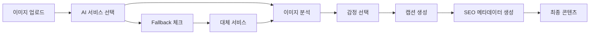

{
  "doc_meta": {
    "id": "AI-001",
    "version": "2025-01-14",
    "owners": ["pablo"],
    "scope": ["ai", "openai", "gpt-4o", "anthropic", "google", "azure"],
    "status": "active",
    "related": ["API-001", "COMP-001", "ARCH-001"]
  }
}

# StayPost AI 통합 가이드

이 문서는 StayPost 프로젝트의 AI 서비스 통합 방법과 구현 세부사항을 설명합니다. 다양한 AI 서비스를 모듈화하여 쉽게 추가하거나 교체할 수 있도록 설계되었습니다.

## 📋 목차
- [개요](#개요)
- [AI 서비스 아키텍처](#ai-서비스-아키텍처)
- [AI 서비스 인터페이스](#ai-서비스-인터페이스)
- [지원 AI 서비스](#지원-ai-서비스)
- [새로운 AI 서비스 추가 가이드](#새로운-ai-서비스-추가-가이드)
- [프롬프트 엔지니어링](#프롬프트-엔지니어링)
- [이미지 분석](#이미지-분석)
- [에러 처리](#에러-처리)
- [성능 최적화](#성능-최적화)
- [비용 관리](#비용-관리)
- [모니터링 및 로깅](#모니터링-및-로깅)

## 개요

StayPost는 다양한 AI 서비스를 통합하여 감정 기반 캡션 생성과 이미지 분석을 수행합니다. 모듈화된 아키텍처를 통해 새로운 AI 서비스를 쉽게 추가하거나 기존 서비스를 교체할 수 있습니다.

### 주요 특징
- 🔌 **플러그인 아키텍처**: 새로운 AI 서비스 쉽게 추가
- 🎯 **서비스 추상화**: 통일된 인터페이스로 다양한 AI 서비스 사용
- 🔄 **Fallback 메커니즘**: 서비스 장애 시 자동 전환
- 📊 **성능 모니터링**: 각 AI 서비스의 성능 추적
- 💰 **비용 최적화**: 서비스별 비용 관리 및 제한

## AI 서비스 아키텍처

### 전체 AI 플로우



### 모듈화된 AI 서비스 구조

```
AI Services
├── Core Interface
│   ├── AIServiceProvider
│   ├── AIServiceConfig
│   └── AIServiceResponse
├── Providers
│   ├── OpenAIProvider
│   ├── AnthropicProvider
│   ├── GoogleAIProvider
│   ├── AzureOpenAIProvider
│   └── CustomProvider
├── Services
│   ├── CaptionGenerationService
│   ├── ImageAnalysisService
│   └── SEOGenerationService
└── Utils
    ├── PromptBuilder
    ├── ResponseParser
    └── ErrorHandler
```

## AI 서비스 인터페이스

### 기본 인터페이스 정의

```typescript
// types/AIService.ts
export interface AIServiceConfig {
  provider: string;
  apiKey: string;
  model: string;
  temperature?: number;
  maxTokens?: number;
  timeout?: number;
}

export interface AIServiceRequest {
  prompt: string;
  images?: string[]; // base64 encoded
  options?: {
    temperature?: number;
    maxTokens?: number;
    responseFormat?: 'text' | 'json';
  };
}

export interface AIServiceResponse {
  content: string;
  usage?: {
    promptTokens: number;
    completionTokens: number;
    totalTokens: number;
  };
  metadata?: {
    model: string;
    provider: string;
    latency: number;
  };
}

export interface AIServiceProvider {
  name: string;
  config: AIServiceConfig;
  
  // 기본 메서드
  generateText(request: AIServiceRequest): Promise<AIServiceResponse>;
  analyzeImage(imageBase64: string, prompt: string): Promise<AIServiceResponse>;
  
  // 유틸리티 메서드
  validateConfig(): boolean;
  getCostEstimate(tokens: number): number;
  isAvailable(): Promise<boolean>;
}
```

### 서비스 팩토리 패턴

```typescript
// services/AIServiceFactory.ts
export class AIServiceFactory {
  private static providers = new Map<string, AIServiceProvider>();
  
  static registerProvider(name: string, provider: AIServiceProvider): void {
    this.providers.set(name, provider);
  }
  
  static getProvider(name: string): AIServiceProvider | null {
    return this.providers.get(name) || null;
  }
  
  static getAvailableProviders(): string[] {
    return Array.from(this.providers.keys());
  }
  
  static async getBestProvider(serviceType: 'caption' | 'image-analysis'): Promise<AIServiceProvider> {
    const providers = Array.from(this.providers.values());
    
    // 가용성 체크
    const availableProviders = await Promise.all(
      providers.map(async (provider) => ({
        provider,
        available: await provider.isAvailable()
      }))
    );
    
    const available = availableProviders
      .filter(p => p.available)
      .map(p => p.provider);
    
    if (available.length === 0) {
      throw new Error('No available AI providers');
    }
    
    // 우선순위에 따라 선택 (설정에서 관리)
    return available[0];
  }
}
```

## 지원 AI 서비스

### 1. OpenAI GPT-4o

```typescript
// providers/OpenAIProvider.ts
import OpenAI from 'openai';

export class OpenAIProvider implements AIServiceProvider {
  name = 'openai';
  private client: OpenAI;
  
  constructor(config: AIServiceConfig) {
    this.config = config;
    this.client = new OpenAI({
      apiKey: config.apiKey,
      dangerouslyAllowBrowser: false
    });
  }
  
  async generateText(request: AIServiceRequest): Promise<AIServiceResponse> {
    const startTime = Date.now();
    
    try {
      const completion = await this.client.chat.completions.create({
        model: this.config.model,
        messages: [
          {
            role: 'system',
            content: '당신은 숙박업소 SNS 마케팅 전문가입니다.'
          },
          {
            role: 'user',
            content: request.prompt
          }
        ],
        temperature: request.options?.temperature || this.config.temperature || 0.7,
        max_tokens: request.options?.maxTokens || this.config.maxTokens || 500
      });
      
      const response = completion.choices[0]?.message?.content || '';
      const usage = completion.usage;
      
      return {
        content: response,
        usage: {
          promptTokens: usage?.prompt_tokens || 0,
          completionTokens: usage?.completion_tokens || 0,
          totalTokens: usage?.total_tokens || 0
        },
        metadata: {
          model: this.config.model,
          provider: this.name,
          latency: Date.now() - startTime
        }
      };
    } catch (error) {
      throw new AIError('OpenAI API 호출 실패', 'OPENAI_ERROR', true);
    }
  }
  
  async analyzeImage(imageBase64: string, prompt: string): Promise<AIServiceResponse> {
    const startTime = Date.now();
    
    try {
      const completion = await this.client.chat.completions.create({
        model: this.config.model,
        messages: [
          {
            role: 'system',
            content: '이미지를 분석하여 숙박업소 마케팅에 필요한 정보를 추출해주세요.'
          },
          {
            role: 'user',
            content: [
              { type: 'text', text: prompt },
              {
                type: 'image_url',
                image_url: {
                  url: `data:image/jpeg;base64,${imageBase64}`
                }
              }
            ]
          }
        ],
        temperature: 0.3,
        max_tokens: 300
      });
      
      const response = completion.choices[0]?.message?.content || '';
      
      return {
        content: response,
        metadata: {
          model: this.config.model,
          provider: this.name,
          latency: Date.now() - startTime
        }
      };
    } catch (error) {
      throw new AIError('OpenAI 이미지 분석 실패', 'OPENAI_IMAGE_ERROR', true);
    }
  }
  
  validateConfig(): boolean {
    return !!(this.config.apiKey && this.config.model);
  }
  
  getCostEstimate(tokens: number): number {
    // GPT-4o 비용 계산 (실제 비용으로 수정 필요)
    const costPer1kTokens = 0.005;
    return (tokens / 1000) * costPer1kTokens;
  }
  
  async isAvailable(): Promise<boolean> {
    try {
      // 간단한 헬스체크
      await this.client.models.list();
      return true;
    } catch {
      return false;
    }
  }
}
```

### 2. Anthropic Claude

```typescript
// providers/AnthropicProvider.ts
import Anthropic from '@anthropic-ai/sdk';

export class AnthropicProvider implements AIServiceProvider {
  name = 'anthropic';
  private client: Anthropic;
  
  constructor(config: AIServiceConfig) {
    this.config = config;
    this.client = new Anthropic({
      apiKey: config.apiKey
    });
  }
  
  async generateText(request: AIServiceRequest): Promise<AIServiceResponse> {
    const startTime = Date.now();
    
    try {
      const message = await this.client.messages.create({
        model: this.config.model,
        max_tokens: request.options?.maxTokens || this.config.maxTokens || 500,
        temperature: request.options?.temperature || this.config.temperature || 0.7,
        messages: [
          {
            role: 'user',
            content: request.prompt
          }
        ]
      });
      
      const response = message.content[0]?.text || '';
      
      return {
        content: response,
        metadata: {
          model: this.config.model,
          provider: this.name,
          latency: Date.now() - startTime
        }
      };
    } catch (error) {
      throw new AIError('Anthropic API 호출 실패', 'ANTHROPIC_ERROR', true);
    }
  }
  
  // 이미지 분석은 Claude 3.5 Sonnet 이상에서 지원
  async analyzeImage(imageBase64: string, prompt: string): Promise<AIServiceResponse> {
    const startTime = Date.now();
    
    try {
      const message = await this.client.messages.create({
        model: this.config.model,
        max_tokens: 300,
        temperature: 0.3,
        messages: [
          {
            role: 'user',
            content: [
              { type: 'text', text: prompt },
              {
                type: 'image',
                source: {
                  type: 'base64',
                  media_type: 'image/jpeg',
                  data: imageBase64
                }
              }
            ]
          }
        ]
      });
      
      const response = message.content[0]?.text || '';
      
      return {
        content: response,
        metadata: {
          model: this.config.model,
          provider: this.name,
          latency: Date.now() - startTime
        }
      };
    } catch (error) {
      throw new AIError('Anthropic 이미지 분석 실패', 'ANTHROPIC_IMAGE_ERROR', true);
    }
  }
  
  validateConfig(): boolean {
    return !!(this.config.apiKey && this.config.model);
  }
  
  getCostEstimate(tokens: number): number {
    // Claude 비용 계산 (실제 비용으로 수정 필요)
    const costPer1kTokens = 0.003;
    return (tokens / 1000) * costPer1kTokens;
  }
  
  async isAvailable(): Promise<boolean> {
    try {
      // 간단한 헬스체크
      await this.client.messages.create({
        model: this.config.model,
        max_tokens: 1,
        messages: [{ role: 'user', content: 'test' }]
      });
      return true;
    } catch {
      return false;
    }
  }
}
```

### 3. Google AI (Gemini)

```typescript
// providers/GoogleAIProvider.ts
import { GoogleGenerativeAI } from '@google/generative-ai';

export class GoogleAIProvider implements AIServiceProvider {
  name = 'google';
  private client: GoogleGenerativeAI;
  private model: any;
  
  constructor(config: AIServiceConfig) {
    this.config = config;
    this.client = new GoogleGenerativeAI(config.apiKey);
    this.model = this.client.getGenerativeModel({ model: config.model });
  }
  
  async generateText(request: AIServiceRequest): Promise<AIServiceResponse> {
    const startTime = Date.now();
    
    try {
      const result = await this.model.generateContent(request.prompt);
      const response = result.response.text();
      
      return {
        content: response,
        metadata: {
          model: this.config.model,
          provider: this.name,
          latency: Date.now() - startTime
        }
      };
    } catch (error) {
      throw new AIError('Google AI API 호출 실패', 'GOOGLE_AI_ERROR', true);
    }
  }
  
  async analyzeImage(imageBase64: string, prompt: string): Promise<AIServiceResponse> {
    const startTime = Date.now();
    
    try {
      const imagePart = {
        inlineData: {
          data: imageBase64,
          mimeType: 'image/jpeg'
        }
      };
      
      const result = await this.model.generateContent([prompt, imagePart]);
      const response = result.response.text();
      
      return {
        content: response,
        metadata: {
          model: this.config.model,
          provider: this.name,
          latency: Date.now() - startTime
        }
      };
    } catch (error) {
      throw new AIError('Google AI 이미지 분석 실패', 'GOOGLE_AI_IMAGE_ERROR', true);
    }
  }
  
  validateConfig(): boolean {
    return !!(this.config.apiKey && this.config.model);
  }
  
  getCostEstimate(tokens: number): number {
    // Gemini 비용 계산 (실제 비용으로 수정 필요)
    const costPer1kTokens = 0.001;
    return (tokens / 1000) * costPer1kTokens;
  }
  
  async isAvailable(): Promise<boolean> {
    try {
      await this.model.generateContent('test');
      return true;
    } catch {
      return false;
    }
  }
}
```

## 새로운 AI 서비스 추가 가이드

### 1. 기본 구조 생성

새로운 AI 서비스를 추가하려면 다음 단계를 따르세요:

#### Step 1: Provider 클래스 생성

```typescript
// providers/YourAIProvider.ts
import { AIServiceProvider, AIServiceConfig, AIServiceRequest, AIServiceResponse } from '../types/AIService';

export class YourAIProvider implements AIServiceProvider {
  name = 'your-ai';
  config: AIServiceConfig;
  
  constructor(config: AIServiceConfig) {
    this.config = config;
  }
  
  async generateText(request: AIServiceRequest): Promise<AIServiceResponse> {
    // 구현 내용
  }
  
  async analyzeImage(imageBase64: string, prompt: string): Promise<AIServiceResponse> {
    // 구현 내용
  }
  
  validateConfig(): boolean {
    // 설정 검증 로직
  }
  
  getCostEstimate(tokens: number): number {
    // 비용 계산 로직
  }
  
  async isAvailable(): Promise<boolean> {
    // 가용성 체크 로직
  }
}
```

#### Step 2: 환경 변수 추가

```env
# .env.local
YOUR_AI_API_KEY=your_api_key_here
YOUR_AI_MODEL=your_model_name
```

#### Step 3: 설정 파일 업데이트

```typescript
// config/aiConfig.ts
export const aiConfig = {
  providers: {
    openai: {
      apiKey: process.env.OPENAI_API_KEY,
      model: 'gpt-4o',
      temperature: 0.7,
      maxTokens: 500
    },
    anthropic: {
      apiKey: process.env.ANTHROPIC_API_KEY,
      model: 'claude-3-5-sonnet-20241022',
      temperature: 0.7,
      maxTokens: 500
    },
    google: {
      apiKey: process.env.GOOGLE_AI_API_KEY,
      model: 'gemini-1.5-pro',
      temperature: 0.7,
      maxTokens: 500
    },
    yourAI: {
      apiKey: process.env.YOUR_AI_API_KEY,
      model: process.env.YOUR_AI_MODEL,
      temperature: 0.7,
      maxTokens: 500
    }
  },
  fallback: {
    primary: 'openai',
    secondary: 'anthropic',
    tertiary: 'google'
  }
};
```

#### Step 4: Provider 등록

```typescript
// services/AIServiceRegistry.ts
import { AIServiceFactory } from './AIServiceFactory';
import { YourAIProvider } from '../providers/YourAIProvider';
import { aiConfig } from '../config/aiConfig';

export function registerAIProviders(): void {
  // OpenAI 등록
  const openaiProvider = new OpenAIProvider(aiConfig.providers.openai);
  AIServiceFactory.registerProvider('openai', openaiProvider);
  
  // Anthropic 등록
  const anthropicProvider = new AnthropicProvider(aiConfig.providers.anthropic);
  AIServiceFactory.registerProvider('anthropic', anthropicProvider);
  
  // Google AI 등록
  const googleProvider = new GoogleAIProvider(aiConfig.providers.google);
  AIServiceFactory.registerProvider('google', googleProvider);
  
  // 새로운 AI 서비스 등록
  const yourAIProvider = new YourAIProvider(aiConfig.providers.yourAI);
  AIServiceFactory.registerProvider('your-ai', yourAIProvider);
}
```

#### Step 5: Supabase Function 업데이트

```typescript
// supabase/functions/generate-caption/index.ts
import { AIServiceFactory } from '../../../src/services/AIServiceFactory';
import { registerAIProviders } from '../../../src/services/AIServiceRegistry';

// Provider 등록
registerAIProviders();

Deno.serve(async (req: Request) => {
  // ... 기존 코드 ...
  
  try {
    // 최적의 AI 서비스 선택
    const provider = await AIServiceFactory.getBestProvider('caption');
    
    const result = await provider.generateText({
      prompt: buildCaptionPrompt({ emotion, templateId, storeName, placeDesc }),
      options: {
        temperature: 0.7,
        maxTokens: 500,
        responseFormat: 'text'
      }
    });
    
    // 응답 파싱
    const parsedResult = parseCaptionResponse(result.content);
    
    return new Response(JSON.stringify(parsedResult), {
      headers: { ...corsHeaders, "Content-Type": "application/json" },
      status: 200,
    });
  } catch (e) {
    // Fallback 처리
    console.error("[generate-caption] ERROR:", e);
    
    // 대체 서비스로 재시도
    try {
      const fallbackProvider = AIServiceFactory.getProvider('anthropic');
      if (fallbackProvider) {
        const result = await fallbackProvider.generateText({
          prompt: buildCaptionPrompt({ emotion, templateId, storeName, placeDesc })
        });
        
        const parsedResult = parseCaptionResponse(result.content);
        
        return new Response(JSON.stringify(parsedResult), {
          headers: { ...corsHeaders, "Content-Type": "application/json" },
          status: 200,
        });
      }
    } catch (fallbackError) {
      console.error("[generate-caption] FALLBACK ERROR:", fallbackError);
    }
    
    return new Response(JSON.stringify({ error: "INTERNAL_ERROR", message: String(e) }), {
      headers: { ...corsHeaders, "Content-Type": "application/json" },
      status: 500,
    });
  }
});
```

### 2. 테스트 및 검증

```typescript
// tests/YourAIProvider.test.ts
import { YourAIProvider } from '../providers/YourAIProvider';

describe('YourAIProvider', () => {
  let provider: YourAIProvider;
  
  beforeEach(() => {
    provider = new YourAIProvider({
      provider: 'your-ai',
      apiKey: 'test-key',
      model: 'test-model'
    });
  });
  
  test('should validate config correctly', () => {
    expect(provider.validateConfig()).toBe(true);
  });
  
  test('should generate text', async () => {
    const result = await provider.generateText({
      prompt: '테스트 프롬프트'
    });
    
    expect(result.content).toBeDefined();
    expect(result.metadata).toBeDefined();
  });
  
  test('should analyze image', async () => {
    const testImage = 'base64-encoded-image-data';
    const result = await provider.analyzeImage(testImage, '이미지를 분석해주세요');
    
    expect(result.content).toBeDefined();
  });
});
```

## 프롬프트 엔지니어링

### 통합 프롬프트 빌더

```typescript
// utils/PromptBuilder.ts
export class PromptBuilder {
  private static emotionContexts = {
    '설렘': '기대감과 설렘을 느낄 수 있는 분위기',
    '평온': '차분하고 평화로운 분위기',
    '즐거움': '활기차고 즐거운 분위기',
    '로맨틱': '로맨틱하고 아름다운 분위기',
    '힐링': '편안하고 힐링되는 분위기'
  };
  
  private static templateStyles = {
    'default_universal': '일반적인 SNS 스타일',
    'ocean_sunset': '오션 선셋 분위기',
    'luxury_pool': '럭셔리 풀 분위기',
    'cafe_cozy': '카페 코지 분위기'
  };
  
  static buildCaptionPrompt(params: {
    emotion: string;
    templateId: string;
    storeName: string;
    placeDesc?: string;
    provider?: string;
  }): string {
    const { emotion, templateId, storeName, placeDesc, provider } = params;
    
    const emotionContext = this.emotionContexts[emotion] || this.emotionContexts['평온'];
    const templateStyle = this.templateStyles[templateId] || this.templateStyles['default_universal'];
    
    // Provider별 최적화된 프롬프트
    const providerSpecificPrompt = this.getProviderSpecificPrompt(provider);
    
    return `
숙박업소 "${storeName}"의 SNS 캡션을 생성해주세요.

감정: ${emotion}
${emotionContext}

스타일: ${templateStyle}

${placeDesc ? `장소 설명: ${placeDesc}` : ''}

${providerSpecificPrompt}

요구사항:
1. 감정에 맞는 톤앤매너로 작성
2. 2-3문장으로 구성
3. 이모지 1-2개 포함
4. 해시태그 3-5개 생성

출력 형식:
훅: [매력적인 첫 문장]
캡션: [본문 내용]
해시태그: [해시태그 목록]
`;
  }
  
  private static getProviderSpecificPrompt(provider?: string): string {
    switch (provider) {
      case 'openai':
        return 'OpenAI GPT 모델의 특성을 활용하여 창의적이고 매력적인 캡션을 생성해주세요.';
      case 'anthropic':
        return 'Claude의 안전하고 신뢰할 수 있는 특성을 활용하여 적절하고 매력적인 캡션을 생성해주세요.';
      case 'google':
        return 'Gemini의 다재다능한 특성을 활용하여 다양한 관점에서 매력적인 캡션을 생성해주세요.';
      default:
        return '';
    }
  }
  
  static buildImageAnalysisPrompt(): string {
    return `
당신은 한국의 펜션/숙박업소 전문 마케팅 분석가입니다.
업로드된 숙소 이미지를 분석하여 다음 정보를 JSON 형태로 제공해주세요:

1. main_features: 이미지에서 보이는 주요 특징들 (최대 5개, 한국어)
   예: ["바다", "수영장", "노을", "산", "정원", "테라스", "바베큐시설", "키즈풀", "자쿠지"]

2. view_type: 숙소의 뷰 타입 (한국어)
   예: "오션뷰", "마운틴뷰", "시티뷰", "가든뷰", "리버뷰", "논뷰", "포레스트뷰", "레이크뷰"

3. emotions: 이 숙소가 자극하는 감성 키워드 (최대 3개, 한국어)
   예: ["감성 힐링", "럭셔리함", "여유로움", "로맨틱", "가족친화", "고요함", "모던함", "아늑함"]

4. hashtags: 인스타그램용 해시태그 (5-8개, 한국어)
   지역명, 숙소타입, 특징을 포함하여 실제 마케팅에 사용할 수 있는 해시태그
   예: ["#제주도펜션", "#오션뷰숙소", "#풀빌라추천", "#감성숙소", "#커플여행"]

반드시 다음 JSON 구조로만 응답하세요:
{
  "main_features": ["특징1", "특징2", "특징3"],
  "view_type": "뷰타입",
  "emotions": ["감성1", "감성2"],
  "hashtags": ["#해시태그1", "#해시태그2", "#해시태그3", "#해시태그4", "#해시태그5"]
}
`;
  }
}
```

## 이미지 분석

### 통합 이미지 분석 서비스

```typescript
// services/ImageAnalysisService.ts
export class ImageAnalysisService {
  private static instance: ImageAnalysisService;
  private cache = new Map<string, any>();
  
  static getInstance(): ImageAnalysisService {
    if (!this.instance) {
      this.instance = new ImageAnalysisService();
    }
    return this.instance;
  }
  
  async analyzeImage(imageBase64: string): Promise<ImageMeta> {
    // 캐시 확인
    const cacheKey = this.generateCacheKey(imageBase64);
    if (this.cache.has(cacheKey)) {
      return this.cache.get(cacheKey);
    }
    
    try {
      // 최적의 AI 서비스 선택
      const provider = await AIServiceFactory.getBestProvider('image-analysis');
      
      const prompt = PromptBuilder.buildImageAnalysisPrompt();
      
      const result = await provider.analyzeImage(imageBase64, prompt);
      
      // 응답 파싱
      const imageMeta = this.parseImageMetaResponse(result.content);
      
      // 캐시에 저장
      this.cache.set(cacheKey, imageMeta);
      
      return imageMeta;
    } catch (error) {
      console.error('Image analysis failed:', error);
      
      // Fallback 처리
      return this.getFallbackImageMeta();
    }
  }
  
  private generateCacheKey(imageBase64: string): string {
    // 간단한 해시 생성 (실제로는 더 정교한 해시 사용)
    return btoa(imageBase64.substring(0, 100));
  }
  
  private parseImageMetaResponse(response: string): ImageMeta {
    try {
      // JSON 파싱 시도
      const jsonMatch = response.match(/\{[\s\S]*\}/);
      if (jsonMatch) {
        return JSON.parse(jsonMatch[0]);
      }
      
      // 텍스트 파싱
      const lines = response.split('\n');
      const result = {
        main_features: [],
        view_type: '',
        emotions: [],
        hashtags: []
      };
      
      for (const line of lines) {
        if (line.includes('주요 특징:')) {
          result.main_features = line.split(':')[1]?.split(',').map(f => f.trim()) || [];
        } else if (line.includes('뷰 타입:')) {
          result.view_type = line.split(':')[1]?.trim() || '';
        } else if (line.includes('감정:')) {
          result.emotions = line.split(':')[1]?.split(',').map(e => e.trim()) || [];
        } else if (line.includes('해시태그:')) {
          result.hashtags = line.split(':')[1]?.split(',').map(h => h.trim()) || [];
        }
      }
      
      return result;
    } catch (error) {
      console.error('Image meta parsing error:', error);
      return this.getFallbackImageMeta();
    }
  }
  
  private getFallbackImageMeta(): ImageMeta {
    return {
      main_features: ['숙박업소'],
      view_type: '일반',
      emotions: ['편안함'],
      hashtags: ['#숙박업소', '#여행']
    };
  }
}
```

## 에러 처리

### 통합 에러 처리 시스템

```typescript
// utils/AIErrorHandler.ts
export class AIError extends Error {
  constructor(
    message: string,
    public code: string,
    public retryable: boolean = false,
    public provider?: string
  ) {
    super(message);
    this.name = 'AIError';
  }
}

export class AIErrorHandler {
  private static errorMap = {
    'INVALID_API_KEY': {
      message: 'API 키가 유효하지 않습니다.',
      retryable: false,
      action: 'API 키를 확인해주세요.'
    },
    'RATE_LIMIT': {
      message: '요청 한도를 초과했습니다.',
      retryable: true,
      action: '잠시 후 다시 시도해주세요.'
    },
    'QUOTA_EXCEEDED': {
      message: '사용량 한도를 초과했습니다.',
      retryable: false,
      action: '다음 달까지 기다리거나 다른 서비스로 전환해주세요.'
    },
    'MODEL_NOT_FOUND': {
      message: '지원하지 않는 모델입니다.',
      retryable: false,
      action: '모델 설정을 확인해주세요.'
    },
    'NETWORK_ERROR': {
      message: '네트워크 연결을 확인해주세요.',
      retryable: true,
      action: '인터넷 연결을 확인하고 다시 시도해주세요.'
    },
    'TIMEOUT': {
      message: '요청 시간이 초과되었습니다.',
      retryable: true,
      action: '잠시 후 다시 시도해주세요.'
    }
  };
  
  static handleError(error: any, provider?: string): AIError {
    if (error instanceof AIError) {
      return error;
    }
    
    // Provider별 에러 처리
    const providerError = this.handleProviderSpecificError(error, provider);
    if (providerError) {
      return providerError;
    }
    
    // 일반적인 에러 처리
    if (error?.response?.status) {
      return this.handleHTTPError(error.response.status, provider);
    }
    
    // 네트워크 에러
    if (error.name === 'TypeError' && error.message.includes('fetch')) {
      return new AIError(
        this.errorMap.NETWORK_ERROR.message,
        'NETWORK_ERROR',
        true,
        provider
      );
    }
    
    return new AIError(
      '알 수 없는 오류가 발생했습니다.',
      'UNKNOWN_ERROR',
      false,
      provider
    );
  }
  
  private static handleProviderSpecificError(error: any, provider?: string): AIError | null {
    switch (provider) {
      case 'openai':
        return this.handleOpenAIError(error);
      case 'anthropic':
        return this.handleAnthropicError(error);
      case 'google':
        return this.handleGoogleAIError(error);
      default:
        return null;
    }
  }
  
  private static handleOpenAIError(error: any): AIError | null {
    if (error?.response?.data?.error?.type) {
      const errorType = error.response.data.error.type;
      
      switch (errorType) {
        case 'invalid_request_error':
          return new AIError('잘못된 요청입니다.', 'INVALID_REQUEST', false, 'openai');
        case 'authentication_error':
          return new AIError('인증에 실패했습니다.', 'AUTH_ERROR', false, 'openai');
        case 'rate_limit_error':
          return new AIError('요청 한도를 초과했습니다.', 'RATE_LIMIT', true, 'openai');
        default:
          return null;
      }
    }
    return null;
  }
  
  private static handleAnthropicError(error: any): AIError | null {
    // Anthropic 특화 에러 처리
    return null;
  }
  
  private static handleGoogleAIError(error: any): AIError | null {
    // Google AI 특화 에러 처리
    return null;
  }
  
  private static handleHTTPError(status: number, provider?: string): AIError {
    switch (status) {
      case 401:
        return new AIError('API 키가 유효하지 않습니다.', 'INVALID_API_KEY', false, provider);
      case 429:
        return new AIError('요청 한도를 초과했습니다.', 'RATE_LIMIT', true, provider);
      case 500:
        return new AIError('AI 서비스에 일시적인 문제가 발생했습니다.', 'AI_SERVICE_ERROR', true, provider);
      default:
        return new AIError('AI 서비스 호출 중 오류가 발생했습니다.', 'UNKNOWN_ERROR', false, provider);
    }
  }
}
```

## 성능 최적화

### 캐싱 및 배치 처리

```typescript
// utils/AIPerformanceOptimizer.ts
export class AIPerformanceOptimizer {
  private static cache = new Map<string, { data: any; timestamp: number; ttl: number }>();
  private static batchQueue: Array<() => Promise<any>> = [];
  private static processing = false;
  
  static async getCachedResult<T>(key: string, ttl: number = 5 * 60 * 1000): Promise<T | null> {
    const item = this.cache.get(key);
    if (!item) return null;
    
    if (Date.now() - item.timestamp > item.ttl) {
      this.cache.delete(key);
      return null;
    }
    
    return item.data as T;
  }
  
  static setCachedResult(key: string, data: any, ttl: number = 5 * 60 * 1000): void {
    this.cache.set(key, {
      data,
      timestamp: Date.now(),
      ttl
    });
  }
  
  static async batchProcess<T>(tasks: Array<() => Promise<T>>, batchSize: number = 5): Promise<T[]> {
    const results: T[] = [];
    
    for (let i = 0; i < tasks.length; i += batchSize) {
      const batch = tasks.slice(i, i + batchSize);
      const batchResults = await Promise.all(batch.map(task => task()));
      results.push(...batchResults);
      
      // 배치 간 딜레이
      if (i + batchSize < tasks.length) {
        await new Promise(resolve => setTimeout(resolve, 1000));
      }
    }
    
    return results;
  }
  
  static clearCache(): void {
    this.cache.clear();
  }
}
```

## 비용 관리

### 통합 비용 관리 시스템

```typescript
// utils/AICostManager.ts
export class AICostManager {
  private static usage = new Map<string, {
    totalTokens: number;
    totalCost: number;
    requests: number;
    dailyCost: number;
    lastReset: string;
  }>();
  
  private static readonly dailyLimits = {
    openai: 10, // $10
    anthropic: 8, // $8
    google: 5, // $5
    default: 5
  };
  
  static recordUsage(provider: string, tokens: number, cost: number): void {
    const today = new Date().toDateString();
    const current = this.usage.get(provider) || {
      totalTokens: 0,
      totalCost: 0,
      requests: 0,
      dailyCost: 0,
      lastReset: today
    };
    
    // 일일 리셋 체크
    if (current.lastReset !== today) {
      current.dailyCost = 0;
      current.lastReset = today;
    }
    
    current.totalTokens += tokens;
    current.totalCost += cost;
    current.dailyCost += cost;
    current.requests += 1;
    
    this.usage.set(provider, current);
    
    // 로깅
    console.log(`[${provider}] Usage: ${tokens} tokens, Cost: $${cost.toFixed(4)}, Daily: $${current.dailyCost.toFixed(4)}`);
  }
  
  static canMakeRequest(provider: string, estimatedCost: number): boolean {
    const limit = this.dailyLimits[provider] || this.dailyLimits.default;
    const current = this.usage.get(provider);
    
    if (!current) return true;
    
    const today = new Date().toDateString();
    if (current.lastReset !== today) {
      return true;
    }
    
    return current.dailyCost + estimatedCost <= limit;
  }
  
  static getUsage(provider?: string): any {
    if (provider) {
      return this.usage.get(provider);
    }
    
    return Object.fromEntries(this.usage);
  }
  
  static getDailyUsage(provider: string): { cost: number; limit: number; remaining: number } {
    const limit = this.dailyLimits[provider] || this.dailyLimits.default;
    const current = this.usage.get(provider);
    
    if (!current) {
      return { cost: 0, limit, remaining: limit };
    }
    
    const today = new Date().toDateString();
    const dailyCost = current.lastReset === today ? current.dailyCost : 0;
    
    return {
      cost: dailyCost,
      limit,
      remaining: limit - dailyCost
    };
  }
  
  static resetUsage(): void {
    this.usage.clear();
  }
}
```

## 모니터링 및 로깅

### AI 서비스 모니터링

```typescript
// utils/AIMonitor.ts
export class AIMonitor {
  private static metrics = {
    requests: 0,
    errors: 0,
    totalLatency: 0,
    providerUsage: new Map<string, number>()
  };
  
  static recordRequest(provider: string, latency: number, success: boolean): void {
    this.metrics.requests += 1;
    this.metrics.totalLatency += latency;
    
    if (!success) {
      this.metrics.errors += 1;
    }
    
    const currentUsage = this.metrics.providerUsage.get(provider) || 0;
    this.metrics.providerUsage.set(provider, currentUsage + 1);
    
    // 로깅
    console.log(`[AIMonitor] ${provider}: ${success ? 'SUCCESS' : 'ERROR'}, ${latency}ms`);
  }
  
  static getMetrics(): any {
    const avgLatency = this.metrics.requests > 0 
      ? this.metrics.totalLatency / this.metrics.requests 
      : 0;
    
    return {
      requests: this.metrics.requests,
      errors: this.metrics.errors,
      errorRate: this.metrics.requests > 0 
        ? (this.metrics.errors / this.metrics.requests) * 100 
        : 0,
      averageLatency: avgLatency,
      providerUsage: Object.fromEntries(this.metrics.providerUsage)
    };
  }
  
  static resetMetrics(): void {
    this.metrics = {
      requests: 0,
      errors: 0,
      totalLatency: 0,
      providerUsage: new Map()
    };
  }
}
```

## 🏛️ ADR (Architecture Decision Records)

### ADR-001: 모듈화된 AI 서비스 아키텍처
**날짜**: 2025-01-14  
**상태**: 승인됨  
**컨텍스트**: 다양한 AI 서비스 통합을 위한 아키텍처 선택  
**결정**: Provider 패턴과 Factory 패턴을 사용한 모듈화된 아키텍처 채택  
**결과**: 새로운 AI 서비스 쉽게 추가 가능, 서비스 간 전환 용이

### ADR-002: Fallback 메커니즘 구현
**날짜**: 2025-01-14  
**상태**: 승인됨  
**컨텍스트**: AI 서비스 장애 시 대응 방안  
**결정**: 다중 서비스 Fallback 메커니즘 구현  
**결과**: 서비스 안정성 향상, 사용자 경험 개선

### ADR-003: 통합 비용 관리 시스템
**날짜**: 2025-01-14  
**상태**: 승인됨  
**컨텍스트**: 다양한 AI 서비스의 비용 관리  
**결정**: 중앙화된 비용 관리 시스템 구현  
**결과**: 비용 추적 및 제한 기능 제공

## 📋 Changelog

| 날짜 | 버전 | 요약 |
|------|------|------|
| 2025-01-14 | v2.0.0 | 모듈화된 AI 서비스 아키텍처로 완전 재작성 |
| 2025-01-14 | v2.1.0 | Anthropic, Google AI 지원 추가 |
| 2025-01-14 | v2.2.0 | Fallback 메커니즘 및 비용 관리 시스템 추가 |
| 2025-01-14 | v2.3.0 | 모니터링 및 로깅 시스템 추가 |

## 🔮 향후 계획

### 단기 계획 (1-3개월)
- [ ] Azure OpenAI 지원 추가
- [ ] 로컬 AI 모델 지원 (Ollama 등)
- [ ] 실시간 성능 대시보드 구현
- [ ] A/B 테스트 프레임워크 구축

### 중기 계획 (3-6개월)
- [ ] 멀티모달 AI 서비스 통합
- [ ] 자동 프롬프트 최적화
- [ ] 사용자별 AI 서비스 선호도 학습
- [ ] 비용 예측 및 알림 시스템

### 장기 계획 (6개월 이상)
- [ ] 자체 AI 모델 개발 검토
- [ ] 엣지 컴퓨팅 기반 AI 처리
- [ ] 실시간 AI 서비스 성능 최적화
- [ ] 글로벌 AI 서비스 확장
