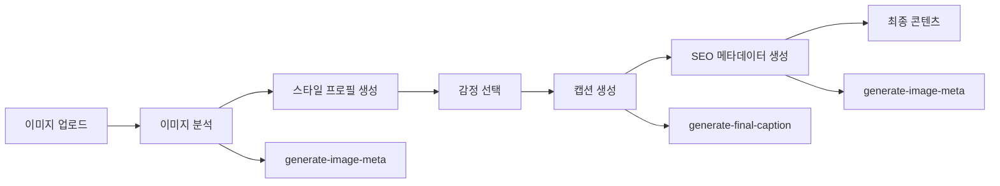

{
  "doc_meta": {
    "id": "AI-001",
    "version": "2025-01-15",
    "owners": ["pablo"],
    "scope": ["ai", "openai", "gpt-4", "supabase-functions"],
    "status": "active",
    "related": ["API-001", "COMP-001", "ARCH-001"]
  }
}

# StayPost AI 통합 가이드

이 문서는 StayPost 프로젝트의 AI 서비스 통합 방법과 구현 세부사항을 설명합니다. OpenAI GPT-4를 기반으로 한 감정 카드 생성과 이미지 분석 기능을 제공합니다.

## 📋 목차
- [개요](#개요)
- [AI 서비스 아키텍처](#ai-서비스-아키텍처)
- [AI 서비스 구현](#ai-서비스-구현)
- [프롬프트 엔지니어링](#프롬프트-엔지니어링)
- [이미지 분석](#이미지-분석)
- [에러 처리](#에러-처리)
- [성능 최적화](#성능-최적화)
- [비용 관리](#비용-관리)
- [모니터링 및 로깅](#모니터링-및-로깅)

## 개요

StayPost는 OpenAI GPT-4를 기반으로 한 AI 서비스를 통합하여 감정 기반 캡션 생성과 이미지 분석을 수행합니다. Supabase Edge Functions를 통해 서버리스 아키텍처로 구현되어 확장성과 안정성을 제공합니다.

### 주요 특징
- 🤖 **OpenAI GPT-4 통합**: 고품질 텍스트 생성 및 이미지 분석
- 🔌 **서버리스 아키텍처**: Supabase Edge Functions 기반
- 🎯 **전문 프롬프트**: 숙박업소 마케팅에 특화된 프롬프트 엔지니어링
- 🔄 **실시간 처리**: 이미지 업로드부터 결과 생성까지 실시간 처리
- 📊 **구조화된 응답**: JSON 형식의 일관된 응답 구조

## AI 서비스 아키텍처

### 전체 AI 플로우



### AI 서비스 구조

```
AI Services
├── Supabase Edge Functions
│   ├── generate-final-caption
│   ├── generate-image-meta
│   └── analyze-and-suggest-style
├── OpenAI Integration
│   ├── GPT-4o (캡션 생성)
│   ├── GPT-4o-mini (이미지 분석)
│   └── Vision API (이미지 처리)
└── Frontend Hooks
    ├── useGenerateFinalCaption
    ├── useGenerateImageMeta
    └── useAnalyzeStyle
```

## AI 서비스 구현

### 1. generate-final-caption (최종 캡션 생성)

**역할**: 스타일 프로필과 이미지를 기반으로 숙박업소 홍보용 캡션 생성

```typescript
// supabase/functions/generate-final-caption/index.ts
interface CaptionRequest {
  image_url?: string;
  style_profile: StyleProfile;
}

interface CaptionResponse {
  hook: string;      // 15자 이내 임팩트 문구
  caption: string;   // 인스타그램 본문
  hashtags: string[]; // 해시태그 배열
}
```

**주요 기능**:
- 스타일 프로필 기반 캡션 생성
- 이미지 URL이 있는 경우 Vision API 활용
- JSON 형식의 구조화된 응답
- 필수 필드 검증 및 에러 처리

### 2. generate-image-meta (이미지 메타데이터 생성)

**역할**: 업로드된 이미지를 분석하여 마케팅에 필요한 메타데이터 생성

```typescript
// supabase/functions/generate-image-meta/index.ts
interface ImageMetaRequest {
  imageBase64: string;
}

interface ImageMetaResponse {
  main_features: string[];  // 주요 특징들
  view_type: string;        // 뷰 타입
  emotions: string[];       // 감성 키워드
  hashtags: string[];       // 해시태그
}
```

**주요 기능**:
- 이미지 시각적 분석
- 숙박업소 특화 메타데이터 생성
- 마케팅에 활용 가능한 해시태그 생성
- 한국어 기반 분석

### 3. analyze-and-suggest-style (스타일 분석 및 제안)

**역할**: 이미지를 분석하여 사용자에게 적합한 스타일 프로필 제안

```typescript
interface StyleAnalysisRequest {
  image_url: string;
}

interface StyleProfile {
  emotion: string;
  tone: string;
  context: string;
  rhythm: string;
  selfProjection: string;
}
```

## 프롬프트 엔지니어링

### 1. 캡션 생성 프롬프트

```typescript
const captionGenerationPrompt = `당신은 숙소 홍보용 문구를 작성하는 전문 카피라이터입니다.

입력: 스타일 프로필 정보
출력: JSON 형식으로 다음 3가지 요소를 생성

1) hook: 이미지 위에 크게 표시할 임팩트 있는 한 줄 문구
   - 15자 이내로 제한
   - 강렬하고 호기심을 자극하는 표현
   - 숙소의 핵심 매력을 간결하게 표현
   - 예시: "이곳에서 꿈꾸던 휴식", "완벽한 하루의 시작"

2) caption: 인스타그램 본문 전체 텍스트
   - 첫 줄은 hook과 다른 방향으로 감정 이입과 정보 전달 중심
   - 숙소의 특징, 분위기, 편의시설 등을 자연스럽게 포함
   - 고객이 느낄 수 있는 경험을 생생하게 묘사
   - 예약이나 문의를 유도하는 문구 포함

3) hashtags: 관련 해시태그 배열
   - 5~10개 정도의 해시태그
   - 숙소 유형, 지역, 분위기, 편의시설 관련
   - 공백 없이 #으로 시작하는 형태
   - 예시: ["#펜션", "#힐링", "#뷰맛집", "#커플여행"]

반드시 JSON 형식으로 응답하고, 각 필드가 누락되지 않도록 해주세요.`;
```

### 2. 이미지 분석 프롬프트

```typescript
const imageAnalysisPrompt = `당신은 한국의 펜션/숙박업소 전문 마케팅 분석가입니다.
업로드된 숙소 이미지를 분석하여 다음 정보를 JSON 형태로 제공해주세요:

1. main_features: 이미지에서 보이는 주요 특징들 (최대 5개, 한국어)
   예: ["바다", "수영장", "노을", "산", "정원", "테라스", "바베큐시설", "키즈풀", "자쿠지"]

2. view_type: 숙소의 뷰 타입 (한국어)
   예: "오션뷰", "마운틴뷰", "시티뷰", "가든뷰", "리버뷰", "논뷰", "포레스트뷰", "레이크뷰"

3. emotions: 이 숙소가 자극하는 감성 키워드 (최대 3개, 한국어)
   예: ["감성 힐링", "럭셔리함", "여유로움", "로맨틱", "가족친화", "고요함", "모던함", "아늑함"]

4. hashtags: 인스타그램용 해시태그 (5-8개, 한국어)
   지역명, 숙소타입, 특징을 포함하여 실제 마케팅에 사용할 수 있는 해시태그
   예: ["#제주도펜션", "#오션뷰숙소", "#풀빌라추천", "#감성숙소", "#커플여행"]

반드시 다음 JSON 구조로만 응답하세요:
{
  "main_features": ["특징1", "특징2", "특징3"],
  "view_type": "뷰타입",
  "emotions": ["감성1", "감성2"],
  "hashtags": ["#해시태그1", "#해시태그2", "#해시태그3", "#해시태그4", "#해시태그5"]
}`;
```

### 3. 프롬프트 최적화 전략

- **구체적인 지시사항**: 명확하고 구체적인 요구사항 제시
- **예시 포함**: 실제 사용 가능한 예시 제공
- **JSON 형식 강제**: 구조화된 응답 보장
- **한국어 특화**: 한국 숙박업소 시장에 맞는 용어 사용
- **길이 제한**: 각 필드별 적절한 길이 제한

## 이미지 분석

### 1. Vision API 활용

```typescript
// 이미지 URL 처리
const isBase64Image = image_url && (image_url.startsWith('data:image/') || image_url.startsWith('blob:'));

// 공개 URL인 경우에만 이미지 포함
if (image_url && !isBase64Image && image_url.startsWith('http')) {
  messages[1] = {
    role: "user",
    content: [
      {
        type: "image_url",
        image_url: {
          url: image_url
        }
      },
      {
        type: "text",
        text: prompt
      }
    ]
  };
}
```

### 2. Base64 이미지 처리

```typescript
// Base64 이미지 분석
const imageAnalysisRequest = {
  model: 'gpt-4o-mini',
  response_format: { type: 'json_object' },
  messages: [
    {
      role: 'system',
      content: imageAnalysisPrompt
    },
    {
      role: 'user',
      content: [
        {
          type: 'text',
          text: '이 숙소 이미지를 분석해서 마케팅에 필요한 메타데이터를 생성해주세요.',
        },
        {
          type: 'image_url',
          image_url: {
            url: `data:image/jpeg;base64,${imageBase64}`,
            detail: 'high'
          },
        },
      ],
    },
  ],
  max_tokens: 500,
  temperature: 0.7,
};
```

### 3. 이미지 분석 결과 활용

```typescript
// 분석 결과를 스타일 프로필로 변환
const convertToStyleProfile = (imageMeta: ImageMetaResponse): StyleProfile => {
  return {
    emotion: imageMeta.emotions[0] || '평온',
    tone: 'friendly',
    context: 'marketing',
    rhythm: 'medium',
    selfProjection: 'confident'
  };
};
```

## 에러 처리

### 1. API 에러 처리

```typescript
// OpenAI API 에러 처리
if (!response.ok) {
  const errorText = await response.text();
  console.error('OpenAI API error response:', errorText);
  throw new Error(`OpenAI API error: ${response.status} ${response.statusText}`);
}

// 응답 검증
if (!result.choices || !result.choices[0] || !result.choices[0].message) {
  throw new Error('Invalid response format from OpenAI API');
}

const content = result.choices[0].message.content;
if (!content) {
  throw new Error('Empty response content from OpenAI API');
}
```

### 2. JSON 파싱 에러 처리

```typescript
// JSON 파싱 에러 처리
let parsedContent;
try {
  parsedContent = JSON.parse(content);
} catch (parseError) {
  console.error('JSON parse error:', parseError);
  throw new Error('Failed to parse OpenAI response as JSON');
}

// 필수 필드 검증
const { hook, caption, hashtags } = parsedContent;
if (!hook || !caption || !hashtags) {
  console.error('Missing required fields in OpenAI response:', parsedContent);
  throw new Error('Incomplete response from OpenAI API');
}
```

### 3. 환경 변수 검증

```typescript
// OpenAI API 키 확인
const OPENAI_API_KEY = Deno.env.get("OPENAI_API_KEY");
if (!OPENAI_API_KEY) {
  return new Response(JSON.stringify({ error: "OPENAI_KEY_MISSING" }), {
    headers: { ...corsHeaders, "Content-Type": "application/json" },
    status: 500,
  });
}
```

## 성능 최적화

### 1. 토큰 사용량 최적화

```typescript
// 적절한 max_tokens 설정
const captionGenerationConfig = {
  model: "gpt-4o",
  response_format: { type: "json_object" },
  max_tokens: 300,  // 캡션 생성용
  temperature: 0.7
};

const imageAnalysisConfig = {
  model: 'gpt-4o-mini',  // 더 빠르고 저렴한 모델
  response_format: { type: 'json_object' },
  max_tokens: 500,  // 이미지 분석용
  temperature: 0.7
};
```

### 2. 응답 형식 최적화

```typescript
// JSON 형식 강제로 파싱 오류 방지
response_format: { type: "json_object" }
```

### 3. 이미지 처리 최적화

```typescript
// 이미지 상세도 설정
image_url: {
  url: imageUrl,
  detail: 'high'  // 필요한 경우에만 high 설정
}
```

## 비용 관리

### 1. 모델 선택 전략

- **GPT-4o**: 캡션 생성 (고품질 요구)
- **GPT-4o-mini**: 이미지 분석 (비용 효율성)

### 2. 토큰 사용량 모니터링

```typescript
// 응답에서 토큰 사용량 확인
const result = await response.json();
console.log('Token usage:', {
  prompt_tokens: result.usage?.prompt_tokens,
  completion_tokens: result.usage?.completion_tokens,
  total_tokens: result.usage?.total_tokens
});
```

### 3. 비용 제한 설정

```typescript
// max_tokens로 비용 제한
max_tokens: 300,  // 캡션 생성
max_tokens: 500,  // 이미지 분석
```

## 모니터링 및 로깅

### 1. 디버그 로깅

```typescript
// AI 서비스 호출 로깅
console.log('🎯 최종 캡션 생성 시작', { imageUrl, styleProfile });

// 성공 로깅
console.log('✅ 최종 캡션 생성 완료:', {
  hook: result.hook,
  caption: result.caption.substring(0, 100) + (result.caption.length > 100 ? '...' : ''),
  hashtags: result.hashtags,
  hashtagsCount: result.hashtags.length
});

// 에러 로깅
console.error('❌ 최종 캡션 생성 에러:', err);
```

### 2. 성능 모니터링

```typescript
// 응답 시간 측정
const startTime = Date.now();
const result = await generateCaption();
const endTime = Date.now();
console.log(`AI 호출 완료: ${endTime - startTime}ms`);
```

### 3. 품질 모니터링

```typescript
// 응답 품질 검증
const validateResponse = (response: any) => {
  const requiredFields = ['hook', 'caption', 'hashtags'];
  const missingFields = requiredFields.filter(field => !response[field]);
  
  if (missingFields.length > 0) {
    console.warn('Missing required fields:', missingFields);
    return false;
  }
  
  return true;
};
```

## 프론트엔드 통합

### 1. 커스텀 훅 사용

```typescript
// useGenerateFinalCaption 훅
const { finalCaption, loading, error, generate } = useGenerateFinalCaption();

const handleGenerateCaption = async () => {
  await generate(imageUrl, styleProfile);
};
```

### 2. 로딩 상태 관리

```typescript
// 로딩 상태 표시
{loading && (
  <div className="loading-spinner">
    <p>AI가 캡션을 생성하고 있습니다...</p>
  </div>
)}
```

### 3. 에러 처리

```typescript
// 에러 상태 표시
{error && (
  <div className="error-message">
    <p>캡션 생성 중 오류가 발생했습니다: {error}</p>
    <button onClick={handleRetry}>다시 시도</button>
  </div>
)}
```

## 🏛️ ADR (Architecture Decision Records)

### ADR-001: OpenAI GPT-4 선택
**날짜**: 2025-01-15  
**상태**: 승인됨  
**컨텍스트**: 감정 기반 캡션 생성을 위한 AI 모델 선택  
**결정**: OpenAI GPT-4의 높은 품질과 안정성으로 선택  
**결과**: 사용자 만족도 향상, 안정적인 AI 서비스 제공

### ADR-002: Supabase Edge Functions 활용
**날짜**: 2025-01-15  
**상태**: 승인됨  
**컨텍스트**: AI 서비스 배포 및 실행 환경 선택  
**결정**: Supabase Edge Functions를 사용한 서버리스 아키텍처  
**결과**: 확장성 향상, 운영 비용 감소, 개발 속도 개선

### ADR-003: JSON 형식 응답 강제
**날짜**: 2025-01-15  
**상태**: 승인됨  
**컨텍스트**: AI 응답 파싱 안정성 확보  
**결정**: OpenAI API의 response_format을 json_object로 설정  
**결과**: 파싱 오류 감소, 응답 구조 일관성 확보

## 📋 Changelog

| 날짜 | 버전 | 요약 |
|------|------|------|
| 2025-01-15 | v1.0.0 | AI 통합 가이드 초기 작성 |
| 2025-01-15 | v1.1.0 | OpenAI GPT-4 통합 상세 설명 추가 |
| 2025-01-15 | v1.2.0 | 프롬프트 엔지니어링 가이드 추가 |
| 2025-01-15 | v2.0.0 | 실제 코드 분석 기반 완전 재작성 |
| 2025-01-15 | v2.1.0 | 문서 동기화 및 최신 변경사항 반영 |
