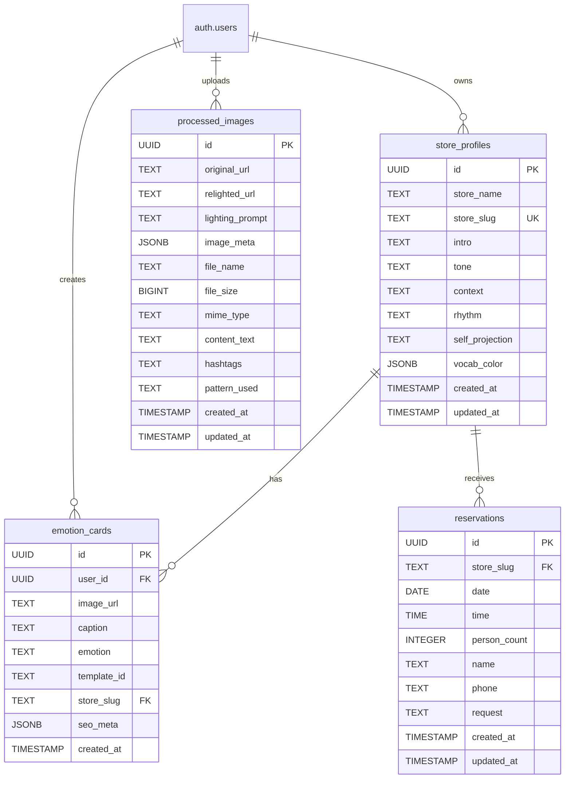

{
  "doc_meta": {
    "id": "DB-001",
    "version": "2025-01-14",
    "owners": ["pablo"],
    "scope": ["database", "supabase", "postgresql"],
    "status": "active",
    "related": ["ARCH-001", "API-001", "COMP-001"]
  }
}

# StayPost 데이터베이스 스키마

이 문서는 StayPost 프로젝트의 Supabase PostgreSQL 데이터베이스 스키마와 관련 설정을 완전히 설명합니다.

## 📋 목차
- [개요](#개요)
- [테이블 구조](#테이블-구조)
- [테이블 관계](#테이블-관계)
- [인덱스](#인덱스)
- [제약 조건](#제약-조건)
- [RLS 정책](#rls-정책)
- [트리거 및 함수](#트리거-및-함수)
- [마이그레이션](#마이그레이션)
- [사용 예시](#사용-예시)

## 개요

StayPost는 Supabase를 기반으로 한 PostgreSQL 데이터베이스를 사용합니다. 주요 테이블은 다음과 같습니다:

- `store_profiles`: 가게 정보 및 스타일 설정 관리
- `emotion_cards`: 감정 카드 데이터 및 SEO 메타데이터
- `reservations`: 예약 정보 관리
- `processed_images`: AI 처리된 이미지 및 콘텐츠 관리

## 테이블 구조

### ERD (Entity Relationship Diagram)



### store_profiles 테이블

가게 정보와 콘텐츠 스타일 설정을 관리하는 테이블입니다.

```sql
CREATE TABLE store_profiles (
  id uuid PRIMARY KEY DEFAULT gen_random_uuid(),
  store_name text NOT NULL,
  store_slug text UNIQUE NOT NULL,
  intro text,
  tone text,
  context text,
  rhythm text,
  self_projection text,
  vocab_color jsonb,
  created_at timestamptz DEFAULT now(),
  updated_at timestamptz DEFAULT now()
);
```

| 컬럼명 | 타입 | 제약조건 | 설명 |
|--------|------|----------|------|
| id | UUID | PRIMARY KEY | 고유 식별자 |
| store_name | TEXT | NOT NULL | 가게명 |
| store_slug | TEXT | UNIQUE, NOT NULL | 가게 슬러그 (URL용) |
| intro | TEXT | - | 펜션 소개 문장 (프롬프트에 활용됨) |
| tone | TEXT | - | 콘텐츠 톤 스타일 (friendly, professional, casual 등) |
| context | TEXT | - | 콘텐츠 컨텍스트 스타일 (marketing, personal, informative 등) |
| rhythm | TEXT | - | 콘텐츠 리듬 스타일 (short, medium, long 등) |
| self_projection | TEXT | - | 자기 투영 스타일 (confident, humble, enthusiastic 등) |
| vocab_color | JSONB | - | 어휘 색상 설정 (JSON 객체) |
| created_at | TIMESTAMPTZ | DEFAULT NOW() | 생성일시 |
| updated_at | TIMESTAMPTZ | DEFAULT NOW() | 수정일시 |

### emotion_cards 테이블

감정 카드 데이터와 SEO 메타데이터를 관리하는 테이블입니다.

```sql
CREATE TABLE emotion_cards (
  id uuid PRIMARY KEY DEFAULT gen_random_uuid(),
  user_id uuid REFERENCES auth.users(id) ON DELETE CASCADE,
  image_url text NOT NULL,
  caption text NOT NULL,
  emotion text,
  template_id text,
  store_slug text,
  seo_meta jsonb,
  created_at timestamptz DEFAULT timezone('utc', now())
);
```

| 컬럼명 | 타입 | 제약조건 | 설명 |
|--------|------|----------|------|
| id | UUID | PRIMARY KEY | 고유 식별자 |
| user_id | UUID | FOREIGN KEY | 사용자 ID (auth.users 참조) |
| image_url | TEXT | NOT NULL | 이미지 URL |
| caption | TEXT | NOT NULL | 생성된 캡션 |
| emotion | TEXT | - | 선택된 감정 |
| template_id | TEXT | - | 템플릿 ID |
| store_slug | TEXT | - | 가게 슬러그 (store_profiles 참조) |
| seo_meta | JSONB | - | SEO 메타데이터 (제목, 키워드, 해시태그 등) |
| created_at | TIMESTAMPTZ | DEFAULT NOW() | 생성일시 |

### processed_images 테이블

AI 처리된 이미지와 생성된 콘텐츠를 관리하는 테이블입니다.

```sql
CREATE TABLE processed_images (
  id uuid PRIMARY KEY DEFAULT gen_random_uuid(),
  original_url text NOT NULL,
  relighted_url text,
  lighting_prompt text,
  image_meta jsonb,
  file_name text NOT NULL,
  file_size bigint NOT NULL,
  mime_type text NOT NULL,
  content_text text,
  hashtags text,
  pattern_used text,
  created_at timestamptz DEFAULT now(),
  updated_at timestamptz DEFAULT now()
);
```

| 컬럼명 | 타입 | 제약조건 | 설명 |
|--------|------|----------|------|
| id | UUID | PRIMARY KEY | 고유 식별자 |
| original_url | TEXT | NOT NULL | 원본 이미지 URL |
| relighted_url | TEXT | - | 리라이팅된 이미지 URL |
| lighting_prompt | TEXT | - | 리라이팅에 사용된 프롬프트 |
| image_meta | JSONB | - | AI 분석된 이미지 메타데이터 |
| file_name | TEXT | NOT NULL | 원본 파일명 |
| file_size | BIGINT | NOT NULL | 파일 크기 (바이트) |
| mime_type | TEXT | NOT NULL | 파일 MIME 타입 |
| content_text | TEXT | - | AI 생성된 StayPost 콘텐츠 |
| hashtags | TEXT | - | 생성된 해시태그 |
| pattern_used | TEXT | - | 콘텐츠 생성에 사용된 패턴 |
| created_at | TIMESTAMPTZ | DEFAULT NOW() | 생성일시 |
| updated_at | TIMESTAMPTZ | DEFAULT NOW() | 수정일시 |

### reservations 테이블

예약 정보를 관리하는 테이블입니다.

```sql
CREATE TABLE reservations (
  id uuid PRIMARY KEY DEFAULT gen_random_uuid(),
  store_slug text NOT NULL,
  date date NOT NULL,
  time time NOT NULL,
  person_count integer NOT NULL CHECK (person_count > 0),
  name text NOT NULL,
  phone text NOT NULL,
  request text,
  created_at timestamptz DEFAULT now(),
  updated_at timestamptz DEFAULT now()
);
```

| 컬럼명 | 타입 | 제약조건 | 설명 |
|--------|------|----------|------|
| id | UUID | PRIMARY KEY | 고유 식별자 |
| store_slug | TEXT | NOT NULL | 가게 슬러그 (store_profiles 참조) |
| date | DATE | NOT NULL | 예약 날짜 |
| time | TIME | NOT NULL | 예약 시간 |
| person_count | INTEGER | NOT NULL, CHECK > 0 | 예약 인원 수 |
| name | TEXT | NOT NULL | 예약자 이름 |
| phone | TEXT | NOT NULL | 예약자 연락처 |
| request | TEXT | - | 특별 요청사항 |
| created_at | TIMESTAMPTZ | DEFAULT NOW() | 생성일시 |
| updated_at | TIMESTAMPTZ | DEFAULT NOW() | 수정일시 |

## 테이블 관계

### 외래 키 관계

1. **emotion_cards.user_id → auth.users.id**
   - 감정 카드는 특정 사용자가 소유
   - CASCADE 삭제: 사용자 삭제 시 관련 카드도 삭제

2. **emotion_cards.store_slug → store_profiles.store_slug**
   - 감정 카드는 특정 가게에 연결
   - 참조 무결성 보장

3. **reservations.store_slug → store_profiles.store_slug**
   - 예약은 특정 가게에 연결
   - 참조 무결성 보장

### 관계 제약 조건

- `store_profiles.store_slug`: UNIQUE 제약조건으로 중복 방지
- `reservations.person_count`: CHECK 제약조건으로 0보다 큰 값만 허용
- `emotion_cards.user_id`: CASCADE 삭제로 데이터 무결성 보장

## 인덱스

```sql
-- store_profiles 테이블 인덱스
CREATE INDEX idx_store_profiles_slug ON store_profiles(store_slug);

-- emotion_cards 테이블 인덱스
-- (RLS 정책으로 인해 자동 인덱스 생성됨)

-- processed_images 테이블 인덱스
-- (공개 접근으로 인해 추가 인덱스 불필요)

-- reservations 테이블 인덱스
CREATE INDEX idx_reservations_store_date ON reservations(store_slug, date);
```

## 제약 조건

### 명시적 제약 조건

```sql
-- reservations 테이블 제약 조건
ALTER TABLE reservations ADD CONSTRAINT check_person_count 
  CHECK (person_count > 0);

-- store_profiles 테이블 제약 조건
ALTER TABLE store_profiles ADD CONSTRAINT store_profiles_store_slug_key 
  UNIQUE (store_slug);
```

### 암시적 제약 조건

- 모든 테이블의 `id` 컬럼: PRIMARY KEY 제약조건
- `emotion_cards.user_id`: FOREIGN KEY 제약조건 (CASCADE 삭제)
- `emotion_cards.image_url`, `emotion_cards.caption`: NOT NULL 제약조건
- `processed_images.original_url`, `processed_images.file_name`, `processed_images.file_size`, `processed_images.mime_type`: NOT NULL 제약조건
- `reservations.store_slug`, `reservations.date`, `reservations.time`, `reservations.person_count`, `reservations.name`, `reservations.phone`: NOT NULL 제약조건

## RLS 정책

### store_profiles 테이블 RLS

```sql
-- RLS 활성화
ALTER TABLE store_profiles ENABLE ROW LEVEL SECURITY;

-- 공개 읽기 정책 (슬러그 확인용)
CREATE POLICY "Allow public read access for slugs"
  ON store_profiles
  FOR SELECT
  TO public
  USING (true);

-- 인증된 사용자 삽입 정책
CREATE POLICY "Allow authenticated users to create stores"
  ON store_profiles
  FOR INSERT
  TO authenticated
  WITH CHECK (true);

-- 인증된 사용자 수정 정책
CREATE POLICY "Allow authenticated users to update stores"
  ON store_profiles
  FOR UPDATE
  TO authenticated
  USING (true);
```

### emotion_cards 테이블 RLS

```sql
-- RLS 활성화
ALTER TABLE emotion_cards ENABLE ROW LEVEL SECURITY;

-- 사용자별 읽기 정책
CREATE POLICY "select_own_emotion_cards"
  ON emotion_cards
  FOR SELECT
  TO authenticated
  USING (auth.uid() = user_id);

-- 사용자별 삽입 정책
CREATE POLICY "insert_own_emotion_card"
  ON emotion_cards
  FOR INSERT
  TO authenticated
  WITH CHECK (auth.uid() = user_id);

-- 사용자별 수정 정책
CREATE POLICY "update_own_emotion_card"
  ON emotion_cards
  FOR UPDATE
  TO authenticated
  USING (auth.uid() = user_id);

-- 사용자별 삭제 정책
CREATE POLICY "delete_own_emotion_card"
  ON emotion_cards
  FOR DELETE
  TO authenticated
  USING (auth.uid() = user_id);
```

### processed_images 테이블 RLS

```sql
-- RLS 활성화
ALTER TABLE processed_images ENABLE ROW LEVEL SECURITY;

-- 공개 읽기 정책 (데모용)
CREATE POLICY "Allow public read access"
  ON processed_images
  FOR SELECT
  TO public
  USING (true);

-- 공개 삽입 정책 (데모용)
CREATE POLICY "Allow public insert"
  ON processed_images
  FOR INSERT
  TO public
  WITH CHECK (true);

-- 공개 수정 정책 (데모용)
CREATE POLICY "Allow public update"
  ON processed_images
  FOR UPDATE
  TO public
  USING (true);
```

### reservations 테이블 RLS

```sql
-- RLS 활성화
ALTER TABLE reservations ENABLE ROW LEVEL SECURITY;

-- 공개 삽입 정책 (예약 제출용)
CREATE POLICY "Allow public insert reservations"
  ON reservations
  FOR INSERT
  TO public
  WITH CHECK (true);

-- 공개 읽기 정책 (예약 확인용)
CREATE POLICY "Allow store owners to read reservations"
  ON reservations
  FOR SELECT
  TO public
  USING (true);
```

## 트리거 및 함수

### updated_at 자동 업데이트 함수

```sql
CREATE OR REPLACE FUNCTION update_updated_at_column()
RETURNS TRIGGER AS $$
BEGIN
  NEW.updated_at = now();
  RETURN NEW;
END;
$$ language 'plpgsql';
```

### 트리거 적용

```sql
-- store_profiles 테이블 트리거
CREATE OR REPLACE TRIGGER update_store_profiles_updated_at
  BEFORE UPDATE ON store_profiles
  FOR EACH ROW
  EXECUTE FUNCTION update_updated_at_column();

-- processed_images 테이블 트리거
CREATE TRIGGER update_processed_images_updated_at
  BEFORE UPDATE ON processed_images
  FOR EACH ROW
  EXECUTE FUNCTION update_updated_at_column();

-- reservations 테이블 트리거
CREATE OR REPLACE TRIGGER update_reservations_updated_at
  BEFORE UPDATE ON reservations
  FOR EACH ROW
  EXECUTE FUNCTION update_updated_at_column();
```

## 마이그레이션

### 마이그레이션 파일 구조

```
supabase/migrations/
├── 20250706121336_damp_pebble.sql          # processed_images 테이블 생성
├── 20250706122155_silver_marsh.sql         # processed_images에 콘텐츠 필드 추가
├── 20250724090704_heavy_torch.sql          # store_profiles 테이블 생성
├── 20250730180000_create_emotion_cards.sql # emotion_cards 테이블 생성
├── 20250731_add_seo_meta_to_emotion_cards.sql # emotion_cards에 SEO 메타 추가
├── 20250101000000_create_reservations_table.sql # reservations 테이블 생성
├── 20250103000000_add_style_presets_to_store_profiles.sql # 스타일 프리셋 추가
├── 20250807_add_intro_to_store_profiles.sql # store_profiles에 intro 추가
└── 20250812090755_add_emotion_cards_policies.sql # emotion_cards RLS 정책
```

### 마이그레이션 실행

```bash
# 로컬 개발 환경
supabase db reset

# 프로덕션 환경
supabase db push

# 특정 마이그레이션만 실행
supabase db push --include-all
```

## 사용 예시

### store_profiles 테이블 예시

```sql
-- 가게 생성
INSERT INTO store_profiles (
  store_name, 
  store_slug, 
  intro, 
  tone, 
  context, 
  rhythm, 
  self_projection, 
  vocab_color
) VALUES (
  '코지 펜션',
  'cozy-pension',
  '자연 속에서 편안한 휴식을 즐기세요',
  'friendly',
  'marketing',
  'medium',
  'confident',
  '{"primary": "warm", "secondary": "nature"}'
);

-- 가게 조회
SELECT * FROM store_profiles 
WHERE store_slug = 'cozy-pension';

-- 스타일 설정 업데이트
UPDATE store_profiles 
SET tone = 'professional', 
    vocab_color = '{"primary": "elegant", "secondary": "luxury"}'
WHERE store_slug = 'cozy-pension';
```

### emotion_cards 테이블 예시

```sql
-- 감정 카드 생성
INSERT INTO emotion_cards (
  user_id,
  image_url, 
  caption, 
  emotion, 
  template_id, 
  store_slug,
  seo_meta
) VALUES (
  '550e8400-e29b-41d4-a716-446655440000',
  'https://storage.supabase.co/emotion-cards/cozy-pension/20250114_123456.jpg',
  '따뜻한 아침, 커피 한 잔과 함께하는 평온한 시간 ☕️',
  '평온',
  'ocean_sunset',
  'cozy-pension',
  '{
    "title": "코지 펜션 - 평온한 아침",
    "keywords": ["펜션", "아침", "커피", "평온"],
    "hashtags": ["#펜션", "#아침", "#커피", "#평온"]
  }'
);

-- 사용자별 감정 카드 조회
SELECT caption, emotion, created_at 
FROM emotion_cards 
WHERE user_id = '550e8400-e29b-41d4-a716-446655440000'
ORDER BY created_at DESC;

-- 가게별 감정 카드 조회
SELECT caption, emotion, seo_meta->>'title' as seo_title
FROM emotion_cards 
WHERE store_slug = 'cozy-pension' 
ORDER BY created_at DESC;
```

### processed_images 테이블 예시

```sql
-- 이미지 업로드 및 처리
INSERT INTO processed_images (
  original_url,
  relighted_url,
  lighting_prompt,
  image_meta,
  file_name,
  file_size,
  mime_type,
  content_text,
  hashtags,
  pattern_used
) VALUES (
  'https://storage.supabase.co/original/cozy-pension/20250114_123456.jpg',
  'https://storage.supabase.co/relighted/cozy-pension/20250114_123456.jpg',
  'warm sunset lighting with golden hour atmosphere',
  '{
    "dominant_colors": ["#FF6B35", "#F7931E"],
    "mood": "warm",
    "composition": "landscape",
    "objects": ["coffee", "window", "nature"]
  }',
  'cozy-pension-morning.jpg',
  2048576,
  'image/jpeg',
  '따뜻한 아침, 커피 한 잔과 함께하는 평온한 시간 ☕️',
  '#펜션 #아침 #커피 #평온 #휴식',
  'morning_cozy'
);

-- 처리된 이미지 조회
SELECT 
  original_url,
  relighted_url,
  content_text,
  hashtags,
  image_meta->>'mood' as mood
FROM processed_images 
WHERE pattern_used = 'morning_cozy'
ORDER BY created_at DESC;
```

### reservations 테이블 예시

```sql
-- 예약 생성
INSERT INTO reservations (
  store_slug, 
  date, 
  time, 
  person_count, 
  name, 
  phone, 
  request
) VALUES (
  'cozy-pension',
  '2025-02-14',
  '18:00:00',
  2,
  '김철수',
  '010-1234-5678',
  '창가 자리로 부탁드립니다'
);

-- 가게별 예약 조회
SELECT name, date, time, person_count, request
FROM reservations 
WHERE store_slug = 'cozy-pension' 
AND date >= CURRENT_DATE 
ORDER BY date, time;

-- 특정 날짜 예약 현황
SELECT 
  time,
  COUNT(*) as reservation_count,
  SUM(person_count) as total_guests
FROM reservations 
WHERE store_slug = 'cozy-pension' 
AND date = '2025-02-14'
GROUP BY time
ORDER BY time;
```

### 실패 케이스 예시

```sql
-- 중복 슬러그 생성 시도 (실패)
INSERT INTO store_profiles (store_name, store_slug) 
VALUES ('다른 펜션', 'cozy-pension');
-- ERROR: duplicate key value violates unique constraint "store_profiles_store_slug_key"

-- 잘못된 인원 수 입력 시도 (실패)
INSERT INTO reservations (store_slug, date, time, person_count, name, phone) 
VALUES ('cozy-pension', '2025-02-14', '18:00:00', 0, '김철수', '010-1234-5678');
-- ERROR: new row for relation "reservations" violates check constraint "check_person_count"

-- 다른 사용자의 감정 카드 수정 시도 (실패 - RLS)
UPDATE emotion_cards 
SET caption = '수정된 캡션'
WHERE id = '550e8400-e29b-41d4-a716-446655440000' 
AND user_id != auth.uid();
-- ERROR: new row violates row-level security policy
```

## 📝 주의사항

1. **RLS 정책**: 모든 테이블에 Row Level Security가 활성화되어 있어 사용자별 데이터 접근이 제한됩니다.
2. **외래 키 제약**: `emotion_cards.user_id`는 CASCADE 삭제로 설정되어 있어 사용자 삭제 시 관련 데이터가 자동 삭제됩니다.
3. **공개 접근**: `processed_images`와 `reservations` 테이블은 데모/예약 목적으로 공개 접근이 허용됩니다.
4. **자동 업데이트**: `updated_at` 컬럼은 트리거를 통해 자동으로 업데이트됩니다.
5. **인덱스**: 자주 조회되는 컬럼에 인덱스가 생성되어 성능을 최적화합니다.

## 🔄 스키마 변경 이력

| 날짜 | 마이그레이션 | 변경 내용 |
|------|-------------|----------|
| 2025-07-06 | damp_pebble | processed_images 테이블 생성 |
| 2025-07-06 | silver_marsh | processed_images에 콘텐츠 필드 추가 |
| 2025-07-24 | heavy_torch | store_profiles 테이블 생성 |
| 2025-07-30 | create_emotion_cards | emotion_cards 테이블 생성 |
| 2025-07-31 | add_seo_meta | emotion_cards에 SEO 메타 추가 |
| 2025-01-01 | create_reservations | reservations 테이블 생성 |
| 2025-01-03 | add_style_presets | store_profiles에 스타일 프리셋 추가 |
| 2025-08-07 | add_intro | store_profiles에 intro 필드 추가 |
| 2025-08-12 | add_emotion_cards_policies | emotion_cards RLS 정책 추가 |
