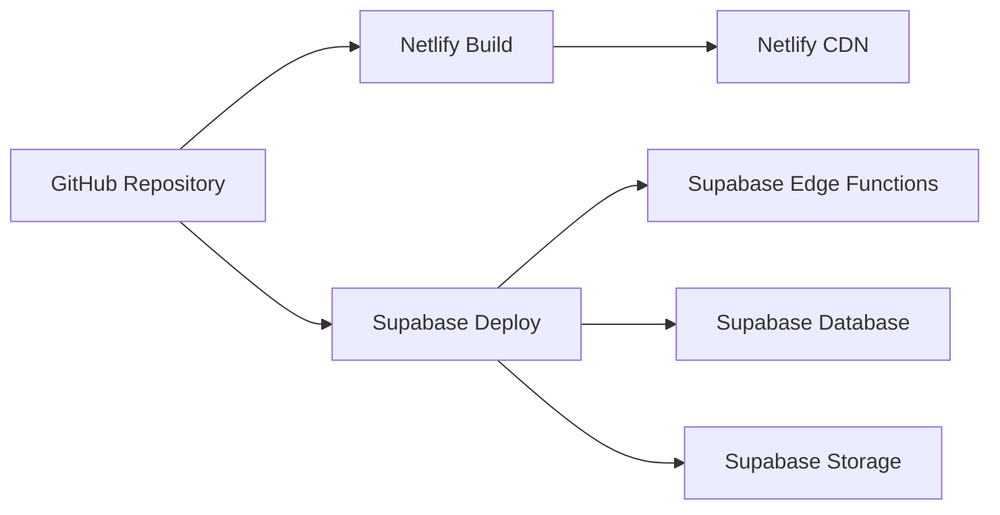

{
  "doc_meta": {
    "id": "DEPLOY-001",
    "version": "2025-01-14",
    "owners": ["pablo"],
    "scope": ["deployment", "netlify", "supabase"],
    "related": ["ARCH-001", "API-001"]
  }
}

# StayPost 배포 가이드

이 문서는 StayPost 프로젝트의 배포 프로세스와 환경 설정을 설명합니다.

## 📋 목차
- [개요](#개요)
- [배포 아키텍처](#배포-아키텍처)
- [개발 환경 설정](#개발-환경-설정)
- [프로덕션 배포](#프로덕션-배포)
- [환경 변수 관리](#환경-변수-관리)
- [도메인 설정](#도메인-설정)
- [모니터링](#모니터링)
- [백업 및 복구](#백업-및-복구)

## 🏗️ 아키텍처
<!-- 아키텍처 관련 내용 -->

## 🔌 API
<!-- API 관련 내용 -->

## 🗄️ 데이터베이스
<!-- 데이터베이스 관련 내용 -->

## 🎨 컴포넌트
<!-- 컴포넌트 관련 내용 -->

## 🔄 상태 관리
<!-- 상태 관리 관련 내용 -->

## 🤖 AI 통합
<!-- AI 통합 관련 내용 -->

## 🐛 문제 해결
<!-- 문제 해결 관련 내용 -->

## 🔮 향후 계획
<!-- 향후 계획 관련 내용 -->

## 개요

StayPost는 프론트엔드는 Netlify에서, 백엔드는 Supabase에서 호스팅되는 하이브리드 아키텍처를 사용합니다. 이는 개발 속도와 운영 안정성을 모두 확보하기 위한 설계입니다.

## 배포 아키텍처

### 전체 배포 구조



### 환경별 구성

```
Development (로컬)
├── Frontend: localhost:5173 (Vite)
├── Backend: localhost:5001 (Express)
└── Database: Supabase Local

Staging (테스트)
├── Frontend: staging.staypost.netlify.app
├── Backend: Supabase Staging
└── Database: Supabase Staging

Production (운영)
├── Frontend: staypost.netlify.app
├── Backend: Supabase Production
└── Database: Supabase Production
```

## 개발 환경 설정

### 1. 로컬 개발 환경

```bash
# 저장소 클론
git clone https://github.com/your-username/staypost.git
cd staypost

# 의존성 설치
npm install

# 환경 변수 설정
cp .env.example .env.local
# .env.local 파일에 필요한 환경 변수 설정

# Supabase 로컬 실행
supabase start

# 개발 서버 실행
npm run dev
```

### 2. 환경 변수 설정

```bash
# .env.local
VITE_SUPABASE_URL=http://localhost:54321
VITE_SUPABASE_ANON_KEY=your_local_anon_key
VITE_API_BASE_URL=http://localhost:5001

# 서버용 환경 변수 (.env)
OPENAI_API_KEY=your_openai_api_key
CLIPDROP_API_KEY=your_clipdrop_api_key
SUPABASE_URL=http://localhost:54321
SUPABASE_SERVICE_ROLE_KEY=your_local_service_role_key
```

### 3. Supabase 로컬 설정

```bash
# Supabase CLI 설치
npm install -g supabase

# 프로젝트 초기화
supabase init

# 로컬 환경 시작
supabase start

# 마이그레이션 적용
supabase db reset
```

## 프로덕션 배포

### 1. Netlify 배포

#### 자동 배포 설정

```toml
# netlify.toml
[build]
  command = "npm run build"
  publish = "dist"
  functions = "netlify/functions"

[build.environment]
  NODE_VERSION = "18"

[[redirects]]
  from = "/api/*"
  to = "/.netlify/functions/:splat"
  status = 200

[[redirects]]
  from = "/*"
  to = "/index.html"
  status = 200
```

#### 수동 배포

```bash
# 빌드
npm run build

# Netlify CLI로 배포
netlify deploy --prod --dir=dist
```

### 2. Supabase 배포

#### Edge Functions 배포

```bash
# 모든 함수 배포
supabase functions deploy

# 특정 함수만 배포
supabase functions deploy generate-caption
supabase functions deploy generate-image-meta
supabase functions deploy create-store
supabase functions deploy check-slug-availability
```

#### 데이터베이스 마이그레이션

```bash
# 프로덕션에 마이그레이션 적용
supabase db push

# 특정 마이그레이션만 적용
supabase db push --include-all
```

### 3. 환경 변수 설정

#### Netlify 환경 변수

```bash
# Netlify CLI로 환경 변수 설정
netlify env:set VITE_SUPABASE_URL "https://your-project.supabase.co"
netlify env:set VITE_SUPABASE_ANON_KEY "your_anon_key"
netlify env:set VITE_API_BASE_URL "https://your-project.supabase.co/functions/v1"
```

#### Supabase 환경 변수

```bash
# Supabase CLI로 환경 변수 설정
supabase secrets set OPENAI_API_KEY=your_openai_api_key
supabase secrets set CLIPDROP_API_KEY=your_clipdrop_api_key
```

## 환경 변수 관리

### 환경별 변수 목록

| 변수명 | 개발 | 스테이징 | 프로덕션 |
|--------|------|----------|----------|
| `VITE_SUPABASE_URL` | localhost:54321 | staging.supabase.co | production.supabase.co |
| `VITE_SUPABASE_ANON_KEY` | local_anon_key | staging_anon_key | production_anon_key |
| `OPENAI_API_KEY` | dev_openai_key | staging_openai_key | production_openai_key |
| `CLIPDROP_API_KEY` | dev_clipdrop_key | staging_clipdrop_key | production_clipdrop_key |

### 보안 고려사항

```bash
# 민감한 정보는 환경 변수로 관리
# 절대 코드에 하드코딩하지 않음
# 프로덕션 키는 별도 관리

# 환경 변수 암호화 (선택사항)
# AWS KMS, HashiCorp Vault 등 사용
```

## 도메인 설정

### 1. 커스텀 도메인 설정

#### Netlify 도메인 설정

```bash
# Netlify CLI로 도메인 추가
netlify domains:add staypost.com

# SSL 인증서 자동 발급
# Netlify에서 자동으로 Let's Encrypt 인증서 발급
```

#### DNS 설정

```dns
# A 레코드
staypost.com.     A     75.2.60.5

# CNAME 레코드
www.staypost.com. CNAME staypost.netlify.app.

# 서브도메인
api.staypost.com. CNAME your-project.supabase.co.
```

### 2. CDN 설정

```toml
# netlify.toml - 캐싱 설정
[[headers]]
  for = "/static/*"
  [headers.values]
    Cache-Control = "public, max-age=31536000"

[[headers]]
  for = "/*.js"
  [headers.values]
    Cache-Control = "public, max-age=31536000"

[[headers]]
  for = "/*.css"
  [headers.values]
    Cache-Control = "public, max-age=31536000"
```

## 모니터링

### 1. Netlify 모니터링

```bash
# 배포 상태 확인
netlify status

# 로그 확인
netlify logs

# 함수 로그 확인
netlify functions:logs
```

### 2. Supabase 모니터링

```bash
# 데이터베이스 상태 확인
supabase status

# 로그 확인
supabase logs

# 함수 로그 확인
supabase functions logs
```

### 3. 외부 모니터링 도구

```yaml
# uptimerobot.com 설정 예시
monitors:
  - name: "StayPost Frontend"
    url: "https://staypost.com"
    type: "http"
    interval: 5

  - name: "StayPost API"
    url: "https://staypost.com/api/health"
    type: "http"
    interval: 5
```

## 백업 및 복구

### 1. 데이터베이스 백업

```bash
# 자동 백업 (Supabase에서 제공)
# 매일 자동으로 백업 수행
# 7일간 보관

# 수동 백업
supabase db dump --data-only > backup_$(date +%Y%m%d).sql

# 특정 테이블만 백업
supabase db dump --table=emotion_cards > emotion_cards_backup.sql
```

### 2. 파일 백업

```bash
# Supabase Storage 백업
# Rclone을 사용한 클라우드 스토리지 백업

# 설정 파일 백업
tar -czf config_backup_$(date +%Y%m%d).tar.gz \
  .env* \
  netlify.toml \
  supabase/config.toml
```

### 3. 복구 절차

```bash
# 데이터베이스 복구
supabase db reset --linked
psql -h db.supabase.co -U postgres -d postgres < backup.sql

# 환경 변수 복구
# Netlify/Supabase 대시보드에서 수동 설정

# 코드 복구
git checkout main
git pull origin main
```

## 🏛️ ADR (Architecture Decision Records)

### ADR-001: Netlify + Supabase 하이브리드 배포
**날짜**: 2025-01-14  
**상태**: 승인됨  
**컨텍스트**: 프론트엔드와 백엔드 배포 플랫폼 선택  
**결정**: Netlify로 프론트엔드, Supabase로 백엔드 분리 배포  
**결과**: 개발 속도와 운영 안정성 모두 확보

### ADR-002: 자동 배포 파이프라인
**날짜**: 2025-01-14  
**상태**: 승인됨  
**컨텍스트**: 배포 자동화 전략  
**결정**: GitHub Actions와 Netlify 자동 배포 연동  
**결과**: 배포 프로세스 자동화 및 인적 오류 감소

## 📋 Changelog

| 날짜 | 버전 | 요약 |
|------|------|------|
| 2025-01-14 | v1.0.0 | 배포 가이드 초기 작성 |
| 2025-01-14 | v1.1.0 | 환경 변수 관리 및 도메인 설정 추가 |
| 2025-01-14 | v1.2.0 | 모니터링 및 백업 가이드 추가 |
