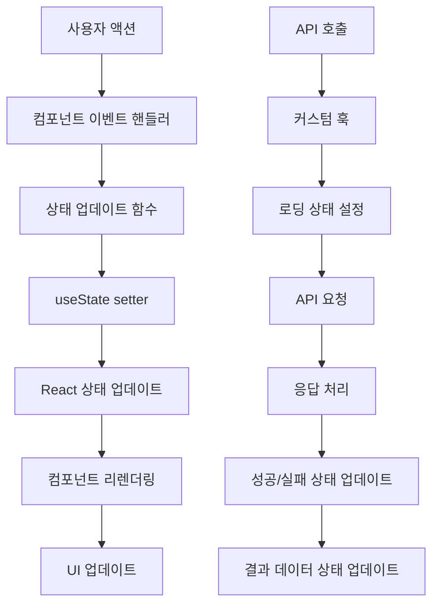

{
  "doc_meta": {
    "id": "STATE-001",
    "version": "2025-01-14",
    "owners": ["pablo"],
    "scope": ["frontend", "react", "state-management"],
    "status": "active",
    "related": ["COMP-001", "ARCH-001", "AI-001", "DB-001"]
  }
}

# StayPost 상태 관리 아키텍처

이 문서는 StayPost 프로젝트의 전역 상태 관리 구조와 데이터 플로우를 상세히 설명합니다. 다른 AI가 상태 변화를 추적하고 이해할 수 있도록 체계적으로 정리했습니다.

## 📋 목차
- [아키텍처 개요](#아키텍처-개요)
- [상태 관리 전략](#상태-관리-전략)
- [전역 상태 구조](#전역-상태-구조)
- [데이터 플로우](#데이터-플로우)
- [커스텀 훅](#커스텀-훅)
- [상태 변화 추적](#상태-변화-추적)
- [성능 최적화](#성능-최적화)
- [에러 처리](#에러-처리)
- [디버깅 가이드](#디버깅-가이드)

## 🏗️ 아키텍처 개요

### 전체 상태 관리 구조

```
StayPost 상태 관리 계층 구조
├── App Level (최상위)
│   ├── 인증 상태 (useAuth)
│   ├── 라우팅 상태 (React Router)
│   └── 전역 에러 상태
│
├── StepWizard Level (중앙 제어)
│   ├── 현재 단계 (step)
│   ├── 공유 데이터 (이미지, 캡션, 메타데이터)
│   ├── UI 상태 (로딩, 에러)
│   └── 네비게이션 상태
│
├── Step Level (단계별)
│   ├── Step1_Upload: 이미지 업로드 상태
│   ├── Step2_Emotion: 감정 선택 및 캡션 생성
│   ├── Step3_Canvas: 캔버스 생성 및 저장
│   ├── Step4_Meta: SEO 메타데이터 관리
│   └── Step5_Export: 최종 내보내기
│
└── Component Level (로컬)
    ├── 폼 상태
    ├── UI 인터랙션 상태
    └── 임시 데이터
```

### 상태 관리 원칙

1. **단방향 데이터 플로우**: 부모 → 자식으로만 데이터 전달
2. **불변성 유지**: 상태 업데이트 시 새로운 객체 생성
3. **최소화**: 필요한 최소한의 상태만 유지
4. **예측 가능성**: 상태 변화가 명확하고 추적 가능
5. **성능 최적화**: 불필요한 리렌더링 방지

## 🎯 상태 관리 전략

### 1. 계층별 상태 분리

```typescript
// App Level - 인증 및 라우팅
const { user, loading, signIn, signOut } = useAuth();

// StepWizard Level - 전역 공유 상태
const [step, setStep] = useState(0);
const [uploadedImage, setUploadedImage] = useState<File | null>(null);
const [previewUrl, setPreviewUrl] = useState<string | null>(null);
// ... 기타 공유 상태들

// Step Level - 단계별 로컬 상태
const [isGenerating, setIsGenerating] = useState(false);
const [generationError, setGenerationError] = useState<string | null>(null);

// Component Level - UI 상태
const [showModal, setShowModal] = useState(false);
const [formData, setFormData] = useState({});
```

### 2. 상태 업데이트 패턴

```typescript
// 올바른 상태 업데이트 패턴
const updateFormData = (field: string, value: any) => {
  setFormData(prev => ({
    ...prev,           // 기존 상태 복사
    [field]: value     // 새로운 값으로 업데이트
  }));
};

// 배열 상태 업데이트
const addItem = (newItem: Item) => {
  setItems(prev => [...prev, newItem]);
};

// 객체 상태 업데이트
const updateUser = (updates: Partial<User>) => {
  setUser(prev => prev ? { ...prev, ...updates } : null);
};
```

## 🔄 전역 상태 구조

### StepWizard 전역 상태 상세 분석

```typescript
// src/components/StepWizard.tsx - 전역 상태 정의
export default function StepWizard({ className = '' }: StepWizardProps) {
  const { user, signOut } = useAuth();
  
  // 1. 네비게이션 상태
  const [step, setStep] = useState(0);
  
  // 2. 이미지 관련 상태
  const [uploadedImage, setUploadedImage] = useState<File | null>(null);
  const [previewUrl, setPreviewUrl] = useState<string | null>(null);
  const [imageDescription, setImageDescription] = useState<string>('');
  
  // 3. AI 분석 및 생성 상태
  const [aiSuggestedStyleProfile, setAiSuggestedStyleProfile] = useState<StyleProfile | null>(null);
  const [isAnalyzing, setIsAnalyzing] = useState<boolean>(false);
  const [isGenerating, setIsGenerating] = useState<boolean>(false);
  const [generatedCaption, setGeneratedCaption] = useState<string>('');
  
  // 4. 캔버스 및 결과 상태
  const [canvasUrl, setCanvasUrl] = useState<string>('');
  const [cardId, setCardId] = useState<string | null>(null);
  
  // 5. SEO 메타데이터 상태 (AI 자동 생성)
  const [seoMeta, setSeoMeta] = useState<{
    title: string;
    keywords: string[];
    hashtags: string[];
    slug: string;
  }>({
    title: '',
    keywords: [],
    hashtags: [],
    slug: ''
  });
  
  // 6. 스토어 관련 상태
  const [storeSlug, setStoreSlug] = useState<string>('default');
  const [hasExistingStore, setHasExistingStore] = useState<boolean>(false);
  const [selectedPreset, setSelectedPreset] = useState<StylePreset>(getDefaultPreset());
}
```

### 상태 타입 정의

```typescript
// 상태 타입 정의 (실제 구현에서는 별도 파일로 분리 권장)
interface StepWizardState {
  // 네비게이션
  step: number;
  
  // 이미지
  uploadedImage: File | null;
  previewUrl: string | null;
  imageDescription: string;
  
  // AI 분석 및 생성
  aiSuggestedStyleProfile: StyleProfile | null;
  isAnalyzing: boolean;
  isGenerating: boolean;
  generatedCaption: string;
  
  // 결과
  canvasUrl: string;
  cardId: string | null;
  
  // 메타데이터 (AI 자동 생성)
  seoMeta: {
    title: string;
    keywords: string[];
    hashtags: string[];
    slug: string;
  };
  
  // 스토어
  storeSlug: string;
  hasExistingStore: boolean;
  selectedPreset: StylePreset;
}

// 상태 변화 액션 타입
type StepWizardAction = 
  | { type: 'SET_STEP'; payload: number }
  | { type: 'SET_UPLOADED_IMAGE'; payload: File | null }
  | { type: 'SET_PREVIEW_URL'; payload: string | null }
  | { type: 'SET_IMAGE_DESCRIPTION'; payload: string }
  | { type: 'SET_AI_SUGGESTED_STYLE_PROFILE'; payload: StyleProfile | null }
  | { type: 'SET_IS_ANALYZING'; payload: boolean }
  | { type: 'SET_IS_GENERATING'; payload: boolean }
  | { type: 'SET_GENERATED_CAPTION'; payload: string }
  | { type: 'SET_CANVAS_URL'; payload: string }
  | { type: 'SET_CARD_ID'; payload: string | null }
  | { type: 'SET_SEO_META'; payload: Partial<SeoMeta> }
  | { type: 'SET_STORE_SLUG'; payload: string }
  | { type: 'SET_HAS_EXISTING_STORE'; payload: boolean }
  | { type: 'SET_SELECTED_PRESET'; payload: StylePreset }
  | { type: 'RESET_STATE' };
```

## 🌊 데이터 플로우

### 1. 전체 데이터 플로우 다이어그램



### 2. 단계별 데이터 플로우

#### Step 1: 이미지 업로드 플로우

```typescript
// 1. 파일 선택 이벤트
const handleFileChange = (event: ChangeEvent<HTMLInputElement>) => {
  const file = event.target.files?.[0];
  if (file) {
    // 2. 상태 업데이트
    setUploadedImage(file);
    setPreviewUrl(URL.createObjectURL(file));
    
    // 3. 이미지 설명 생성 (AI)
    generateImageDescription(file);
  }
};

// 4. AI 이미지 분석
const generateImageDescription = async (file: File) => {
  setIsGenerating(true);
  try {
    const content = await generateContent(file);
    setImageDescription(content.meta.main_features.join(', '));
  } catch (error) {
    setGenerationError(error.message);
  } finally {
    setIsGenerating(false);
  }
};
```

#### Step 2: 감정 선택 및 캡션 생성 플로우

```typescript
// 1. 감정 선택
const handleEmotionSelect = (emotion: string) => {
  setSelectedEmotion(emotion);
  setTemplateId('default_universal'); // 기본 템플릿으로 리셋
};

// 2. 캡션 생성 요청
const handleGenerateCaption = async () => {
  setIsGenerating(true);
  try {
    const result = await generateCaption(
      selectedEmotion,
      templateId,
      storeName,
      imageDescription
    );
    setGeneratedCaption(result.caption);
  } catch (error) {
    setGenerationError(error.message);
  } finally {
    setIsGenerating(false);
  }
};
```

#### Step 3: 캔버스 생성 플로우

```typescript
// 1. 캔버스 생성 요청
const handleGenerateCanvas = async () => {
  setIsGenerating(true);
  try {
    // 2. 캔버스 생성 API 호출
    const canvasData = await generateCanvas({
      imageUrl: previewUrl,
      caption: generatedCaption,
      emotion: selectedEmotion,
      template: templateId,
      preset: selectedPreset
    });
    
    // 3. 상태 업데이트
    setCanvasUrl(canvasData.url);
    setCardId(canvasData.cardId);
  } catch (error) {
    setGenerationError(error.message);
  } finally {
    setIsGenerating(false);
  }
};
```

### 3. 상태 동기화 플로우

```typescript
// StepWizard에서 상태 변화 추적
useEffect(() => {
  console.log('🪄 StepWizard State Update:');
  console.log('🪄 current step:', step);
  console.log('🪄 uploadedImage:', uploadedImage?.name || 'null');
  console.log('🪄 previewUrl:', previewUrl ? 'exists' : 'null');
  console.log('🪄 imageDescription:', imageDescription || 'null');
  console.log('🪄 selectedEmotion:', selectedEmotion);
  console.log('🪄 templateId:', templateId);
  console.log('🪄 generatedCaption:', generatedCaption ? `${generatedCaption.substring(0, 30)}...` : 'null');
  console.log('🪄 canvasUrl:', canvasUrl ? `${canvasUrl.substring(0, 50)}...` : 'null');
  console.log('🪄 cardId:', cardId);
  console.log('🪄 seoMeta:', seoMeta);
  console.log('🪄 storeSlug:', storeSlug);
  console.log('🪄 hasExistingStore:', hasExistingStore);
  console.log('🪄 selectedPreset:', selectedPreset);
}, [step, uploadedImage, previewUrl, imageDescription, selectedEmotion, templateId, generatedCaption, canvasUrl, cardId, seoMeta, storeSlug, hasExistingStore, selectedPreset]);
```

## 🎣 커스텀 훅

### 1. useAuth - 인증 상태 관리

```typescript
// src/hooks/useAuth.ts
export function useAuth() {
  const [user, setUser] = useState<User | null>(null);
  const [session, setSession] = useState<Session | null>(null);
  const [loading, setLoading] = useState(true);

  // 인증 상태 확인
  const checkAuthStatus = async () => {
    try {
      const { data: { session }, error } = await supabase.auth.getSession();
      if (error) throw error;
      
      setSession(session);
      setUser(session?.user ?? null);
    } catch (error) {
      console.error('Error checking auth status:', error);
    } finally {
      setLoading(false);
    }
  };

  // 로그인
  const signIn = async () => {
    try {
      const { error } = await supabase.auth.signInWithOAuth({
        provider: 'google',
        options: {
          redirectTo: window.location.origin
        }
      });
      if (error) throw error;
    } catch (error) {
      console.error('Error signing in:', error);
      throw error;
    }
  };

  // 로그아웃
  const signOut = async () => {
    try {
      const { error } = await supabase.auth.signOut();
      if (error) throw error;
      
      setUser(null);
      setSession(null);
    } catch (error) {
      console.error('Error signing out:', error);
      throw error;
    }
  };

  // 인증 상태 모니터링
  useEffect(() => {
    checkAuthStatus();

    const { data: { subscription } } = supabase.auth.onAuthStateChange(
      async (event, session) => {
        setSession(session);
        setUser(session?.user ?? null);
        setLoading(false);
      }
    );

    return () => subscription.unsubscribe();
  }, []);

  return {
    user,
    session,
    loading,
    signIn,
    signOut,
    checkAuthStatus
  };
}
```

### 2. useGenerateCaptions - 캡션 생성

```typescript
// src/hooks/useGenerateCaptions.ts
export default function useGenerateCaptions(): UseGenerateCaptionsReturn {
  const [captions, setCaptions] = useState<CaptionResult[]>([]);
  const [loading, setLoading] = useState<boolean>(false);
  const [error, setError] = useState<string | null>(null);

  const generate = async (
    emotion: string, 
    templateId: string, 
    storeName?: string, 
    placeDesc?: string
  ): Promise<void> => {
    if (!emotion || !templateId) {
      setError('Emotion and template ID are required');
      return;
    }

    setLoading(true);
    setError(null);

    try {
      const payload = {
        emotion: emotion,
        templateId: templateId,
        storeName: storeName ?? '',
        placeDesc: placeDesc ?? '',
      };

      const { data, error } = await invokeSupabaseFunction('generate-caption', {
        method: 'POST',
        body: payload,
      });
      
      if (error) {
        throw new Error(error.message || 'Failed to generate caption');
      }
      
      if (!data || (!data.hook && !data.caption)) {
        throw new Error('No caption received from the server');
      }
      
      setCaptions([{
        hook: data.hook || '',
        caption: data.caption || '',
        hashtags: data.hashtags || []
      }]);
    } catch (err: any) {
      if (err.name === 'TypeError' && err.message.includes('fetch')) {
        setError('Network error: Unable to reach the server');
      } else {
        setError(err instanceof Error ? err.message : 'An unexpected error occurred');
      }
      setCaptions([]);
    } finally {
      setLoading(false);
    }
  };

  return {
    captions,
    loading,
    error,
    generate,
  };
}
```

### 3. useGenerateStayPostContent - 콘텐츠 생성

```typescript
// src/hooks/useGenerateStayPostContent.ts
export default function useGenerateStayPostContent(): UseGenerateStayPostContentReturn {
  const [content, setContent] = useState<StayPostContent | null>(null);
  const [loading, setLoading] = useState<boolean>(false);
  const [error, setError] = useState<string | null>(null);

  const generateContent = async (imageFile: File): Promise<void> => {
    if (!imageFile) {
      setError('이미지 파일이 필요합니다');
      return;
    }

    setLoading(true);
    setError(null);
    setContent(null);

    try {
      // 1. File을 base64로 변환
      const imageBase64 = await convertFileToBase64(imageFile);

      // 2. 이미지 메타데이터 생성
      const { data, error } = await invokeSupabaseFunction('generate-image-meta', {
        imageBase64
      });

      if (error) {
        throw new Error(error.message || 'Failed to generate image meta');
      }

      if (!data) {
        throw new Error('No data received from the server');
      }

      // 3. 이미지 메타데이터 받기
      const imageMeta: ImageMeta = data as ImageMeta;
      
      // 4. 패턴 선택 및 콘텐츠 생성
      const selectedPattern = selectPattern(imageMeta);
      const generatedText = generateTextByPattern(selectedPattern, imageMeta);
      const hashtags = typeof imageMeta.hashtags === 'string'
        ? (imageMeta.hashtags as string).split(' ')
        : imageMeta.hashtags;

      // 5. 최종 결과 구성
      const finalContent: StayPostContent = {
        content: generatedText,
        hashtags,
        pattern_used: selectedPattern.name,
        meta: imageMeta,
      };

      setContent(finalContent);
    } catch (err) {
      console.error('StayPost 콘텐츠 생성 실패:', err);
      setError(err instanceof Error ? err.message : '알 수 없는 오류가 발생했습니다');
      setContent(null);
    } finally {
      setLoading(false);
    }
  };

  return {
    content,
    loading,
    error,
    generateContent,
  };
}
```

## 🔍 상태 변화 추적

### 1. 상태 변화 로깅 시스템

```typescript
// 개발 환경에서 상태 변화 추적
const useStateLogger = <T>(state: T, stateName: string) => {
  useEffect(() => {
    if (process.env.NODE_ENV === 'development') {
      console.log(`🔄 [${stateName}] State changed:`, state);
    }
  }, [state, stateName]);
};

// StepWizard에서 사용
const [step, setStep] = useState(0);
useStateLogger(step, 'Step');

const [uploadedImage, setUploadedImage] = useState<File | null>(null);
useStateLogger(uploadedImage, 'UploadedImage');
```

### 2. 상태 변화 히스토리 추적

```typescript
// 상태 변화 히스토리 추적 훅
const useStateHistory = <T>(initialState: T, maxHistory: number = 10) => {
  const [state, setState] = useState<T>(initialState);
  const [history, setHistory] = useState<T[]>([]);

  const updateState = useCallback((newState: T) => {
    setState(newState);
    setHistory(prev => {
      const newHistory = [...prev, newState];
      if (newHistory.length > maxHistory) {
        return newHistory.slice(-maxHistory);
      }
      return newHistory;
    });
  }, [maxHistory]);

  const undo = useCallback(() => {
    if (history.length > 1) {
      const previousState = history[history.length - 2];
      setState(previousState);
      setHistory(prev => prev.slice(0, -1));
    }
  }, [history]);

  return { state, updateState, history, undo };
};
```

### 3. 상태 변화 이벤트 시스템

```typescript
// 상태 변화 이벤트 타입
type StateChangeEvent = {
  timestamp: number;
  component: string;
  stateName: string;
  oldValue: any;
  newValue: any;
  trigger: string;
};

// 상태 변화 이벤트 추적
const useStateChangeTracker = () => {
  const [events, setEvents] = useState<StateChangeEvent[]>([]);

  const trackChange = useCallback((
    component: string,
    stateName: string,
    oldValue: any,
    newValue: any,
    trigger: string
  ) => {
    const event: StateChangeEvent = {
      timestamp: Date.now(),
      component,
      stateName,
      oldValue,
      newValue,
      trigger
    };

    setEvents(prev => [...prev, event]);
    
    if (process.env.NODE_ENV === 'development') {
      console.log('📊 State Change Event:', event);
    }
  }, []);

  return { events, trackChange };
};
```

## ⚡ 성능 최적화

### 1. useCallback 최적화

```typescript
// 자주 변경되지 않는 함수들을 useCallback으로 메모이제이션
const handleFileChange = useCallback((event: ChangeEvent<HTMLInputElement>) => {
  const file = event.target.files?.[0];
  if (file) {
    setUploadedImage(file);
    setPreviewUrl(URL.createObjectURL(file));
  }
}, []);

const handleEmotionSelect = useCallback((emotion: string) => {
  setSelectedEmotion(emotion);
  setTemplateId('default_universal');
}, []);

const handleNext = useCallback(() => {
  setStep(prev => Math.min(prev + 1, 4));
}, []);

const handleBack = useCallback(() => {
  setStep(prev => Math.max(prev - 1, 0));
}, []);
```

### 2. useMemo 최적화

```typescript
// 계산 비용이 높은 값들을 useMemo로 메모이제이션
const filteredStores = useMemo(() => {
  return existingStores.filter(store => 
    store.store_name.toLowerCase().includes(searchTerm.toLowerCase())
  );
}, [existingStores, searchTerm]);

const canProceed = useMemo(() => {
  return uploadedImage && selectedEmotion && generatedCaption;
}, [uploadedImage, selectedEmotion, generatedCaption]);

const stepProgress = useMemo(() => {
  return {
    current: step,
    total: 5,
    percentage: (step / 4) * 100,
    canGoNext: canProceed,
    canGoBack: step > 0
  };
}, [step, canProceed]);
```

### 3. React.memo 최적화

```typescript
// 불필요한 리렌더링 방지
const EmotionSelector = React.memo(({ 
  selectedEmotion, 
  onEmotionSelect,
  emotions 
}: EmotionSelectorProps) => {
  return (
    <div className="emotion-selector">
      {emotions.map(emotion => (
        <button
          key={emotion}
          onClick={() => onEmotionSelect(emotion)}
          className={`emotion-button ${selectedEmotion === emotion ? 'selected' : ''}`}
        >
          {emotion}
        </button>
      ))}
    </div>
  );
});

// props 비교 함수 (선택적)
EmotionSelector.displayName = 'EmotionSelector';
```

### 4. 상태 분할 최적화

```typescript
// 큰 상태 객체를 작은 단위로 분할
const useImageState = () => {
  const [uploadedImage, setUploadedImage] = useState<File | null>(null);
  const [previewUrl, setPreviewUrl] = useState<string | null>(null);
  const [imageDescription, setImageDescription] = useState<string>('');
  
  return {
    uploadedImage,
    setUploadedImage,
    previewUrl,
    setPreviewUrl,
    imageDescription,
    setImageDescription
  };
};

const useContentState = () => {
  const [selectedEmotion, setSelectedEmotion] = useState<string>('');
  const [templateId, setTemplateId] = useState<string>('');
  const [generatedCaption, setGeneratedCaption] = useState<string>('');
  
  return {
    selectedEmotion,
    setSelectedEmotion,
    templateId,
    setTemplateId,
    generatedCaption,
    setGeneratedCaption
  };
};
```

## 🚨 에러 처리

### 1. 에러 상태 관리

```typescript
// 에러 상태 타입
interface ErrorState {
  hasError: boolean;
  message: string | null;
  code?: string;
  timestamp?: number;
  retryCount?: number;
}

// 에러 처리 훅
const useErrorHandler = () => {
  const [error, setError] = useState<ErrorState>({
    hasError: false,
    message: null
  });

  const handleError = useCallback((error: Error | string, code?: string) => {
    const errorMessage = error instanceof Error ? error.message : error;
    setError({
      hasError: true,
      message: errorMessage,
      code,
      timestamp: Date.now(),
      retryCount: 0
    });
  }, []);

  const clearError = useCallback(() => {
    setError({
      hasError: false,
      message: null
    });
  }, []);

  const retry = useCallback(() => {
    setError(prev => ({
      ...prev,
      retryCount: (prev.retryCount || 0) + 1
    }));
  }, []);

  return {
    error,
    handleError,
    clearError,
    retry
  };
};
```

### 2. API 에러 처리

```typescript
// API 에러 처리 래퍼
const withErrorHandling = <T extends any[], R>(
  fn: (...args: T) => Promise<R>,
  errorHandler: (error: Error) => void
) => {
  return async (...args: T): Promise<R | null> => {
    try {
      return await fn(...args);
    } catch (error) {
      errorHandler(error instanceof Error ? error : new Error(String(error)));
      return null;
    }
  };
};

// 사용 예시
const generateCaptionWithErrorHandling = withErrorHandling(
  generateCaption,
  (error) => {
    console.error('Caption generation failed:', error);
    setGenerationError(error.message);
  }
);
```

### 3. 에러 바운더리

```typescript
// 상태 관련 에러 처리
class StateErrorBoundary extends React.Component<
  { children: React.ReactNode },
  { hasError: boolean; error?: Error }
> {
  constructor(props: { children: React.ReactNode }) {
    super(props);
    this.state = { hasError: false };
  }

  static getDerivedStateFromError(error: Error) {
    return { hasError: true, error };
  }

  componentDidCatch(error: Error, errorInfo: React.ErrorInfo) {
    console.error('State error:', error, errorInfo);
    
    // 에러 로깅 서비스에 전송
    if (process.env.NODE_ENV === 'production') {
      // Sentry, LogRocket 등에 에러 전송
    }
  }

  render() {
    if (this.state.hasError) {
      return (
        <div className="error-boundary">
          <h2>상태 관리 중 오류가 발생했습니다</h2>
          <p>페이지를 새로고침해주세요.</p>
          <button onClick={() => window.location.reload()}>
            새로고침
          </button>
        </div>
      );
    }

    return this.props.children;
  }
}
```

## 🐛 디버깅 가이드

### 1. 상태 변화 디버깅

```typescript
// 상태 변화 디버깅 훅
const useDebugState = <T>(state: T, label: string) => {
  useEffect(() => {
    if (process.env.NODE_ENV === 'development') {
      console.group(`🔍 [${label}] State Change`);
      console.log('Previous:', state);
      console.log('Timestamp:', new Date().toISOString());
      console.trace('Stack trace');
      console.groupEnd();
    }
  }, [state, label]);
};

// 사용 예시
const [step, setStep] = useState(0);
useDebugState(step, 'StepWizard.step');
```

### 2. 상태 스냅샷 디버깅

```typescript
// 상태 스냅샷 생성
const createStateSnapshot = (state: any, label: string) => {
  const snapshot = {
    label,
    timestamp: new Date().toISOString(),
    state: JSON.parse(JSON.stringify(state)), // 깊은 복사
    url: window.location.href,
    userAgent: navigator.userAgent
  };

  if (process.env.NODE_ENV === 'development') {
    console.log('📸 State Snapshot:', snapshot);
  }

  return snapshot;
};

// 전체 상태 스냅샷
const createFullStateSnapshot = () => {
  return {
    stepWizard: {
      step,
      uploadedImage: uploadedImage?.name,
      previewUrl: previewUrl ? 'exists' : null,
      selectedEmotion,
      generatedCaption: generatedCaption?.substring(0, 50),
      canvasUrl: canvasUrl ? 'exists' : null,
      cardId
    },
    auth: {
      user: user?.email,
      loading
    },
    timestamp: new Date().toISOString()
  };
};
```

### 3. 상태 복원 디버깅

```typescript
// 상태 복원 기능
const useStateRestoration = <T>(initialState: T, storageKey: string) => {
  const [state, setState] = useState<T>(() => {
    try {
      const saved = localStorage.getItem(storageKey);
      return saved ? JSON.parse(saved) : initialState;
    } catch {
      return initialState;
    }
  });

  useEffect(() => {
    localStorage.setItem(storageKey, JSON.stringify(state));
  }, [state, storageKey]);

  const resetState = useCallback(() => {
    setState(initialState);
    localStorage.removeItem(storageKey);
  }, [initialState, storageKey]);

  return { state, setState, resetState };
};
```

### 4. 성능 모니터링

```typescript
// 렌더링 성능 모니터링
const useRenderMonitor = (componentName: string) => {
  const renderCount = useRef(0);
  const lastRenderTime = useRef(Date.now());

  useEffect(() => {
    renderCount.current += 1;
    const now = Date.now();
    const timeSinceLastRender = now - lastRenderTime.current;
    lastRenderTime.current = now;

    if (process.env.NODE_ENV === 'development') {
      console.log(`🎯 [${componentName}] Render #${renderCount.current} (${timeSinceLastRender}ms)`);
    }
  });

  return { renderCount: renderCount.current };
};
```

## 📊 상태 관리 메트릭

### 1. 상태 변화 통계

```typescript
// 상태 변화 통계 추적
const useStateMetrics = () => {
  const [metrics, setMetrics] = useState({
    totalChanges: 0,
    changesByState: {} as Record<string, number>,
    averageChangeInterval: 0,
    lastChangeTime: Date.now()
  });

  const trackChange = useCallback((stateName: string) => {
    const now = Date.now();
    setMetrics(prev => {
      const changesByState = {
        ...prev.changesByState,
        [stateName]: (prev.changesByState[stateName] || 0) + 1
      };

      const totalChanges = prev.totalChanges + 1;
      const averageChangeInterval = totalChanges > 1 
        ? (now - prev.lastChangeTime) / totalChanges 
        : 0;

      return {
        totalChanges,
        changesByState,
        averageChangeInterval,
        lastChangeTime: now
      };
    });
  }, []);

  return { metrics, trackChange };
};
```

### 2. 메모리 사용량 모니터링

```typescript
// 메모리 사용량 모니터링
const useMemoryMonitor = () => {
  const [memoryInfo, setMemoryInfo] = useState<any>(null);

  useEffect(() => {
    const updateMemoryInfo = () => {
      if ('memory' in performance) {
        setMemoryInfo(performance.memory);
      }
    };

    updateMemoryInfo();
    const interval = setInterval(updateMemoryInfo, 5000);

    return () => clearInterval(interval);
  }, []);

  return memoryInfo;
};
```

## 🏛️ ADR (Architecture Decision Records)

### ADR-001: React 내장 상태 관리 사용
**날짜**: 2025-01-14  
**상태**: 승인됨  
**컨텍스트**: 복잡한 전역 상태 관리 라이브러리 vs React 내장 기능  
**결정**: React의 useState, useContext, 커스텀 훅을 조합하여 사용  
**결과**: 번들 크기 감소 및 학습 곡선 완화

### ADR-002: 단방향 데이터 플로우
**날짜**: 2025-01-14  
**상태**: 승인됨  
**컨텍스트**: 상태 업데이트 패턴 선택  
**결정**: 부모에서 자식으로만 데이터를 전달하는 단방향 플로우 채택  
**결과**: 예측 가능한 상태 변화 및 디버깅 용이성 향상

### ADR-003: 커스텀 훅 기반 상태 관리
**날짜**: 2025-01-14  
**상태**: 승인됨  
**컨텍스트**: 상태 로직 재사용성 및 테스트 용이성  
**결정**: 비즈니스 로직을 커스텀 훅으로 분리  
**결과**: 코드 재사용성 향상 및 테스트 용이성 개선

## 📋 Changelog

| 날짜 | 버전 | 요약 |
|------|------|------|
| 2025-01-14 | v2.0.0 | 상태 관리 아키텍처 완전 재작성 |
| 2025-01-14 | v2.1.0 | 데이터 플로우 다이어그램 추가 |
| 2025-01-14 | v2.2.0 | 상태 변화 추적 시스템 추가 |
| 2025-01-14 | v2.3.0 | 성능 최적화 가이드 추가 |
| 2025-01-14 | v2.4.0 | 에러 처리 및 디버깅 가이드 추가 |
| 2025-01-14 | v2.5.0 | 문서 동기화 및 최신 변경사항 반영 |
