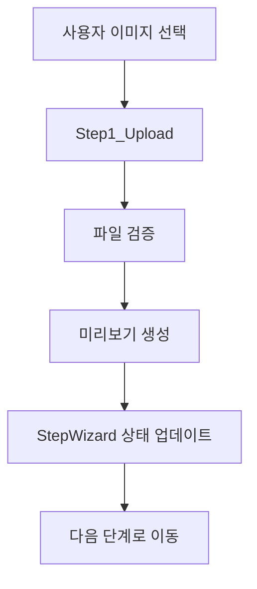
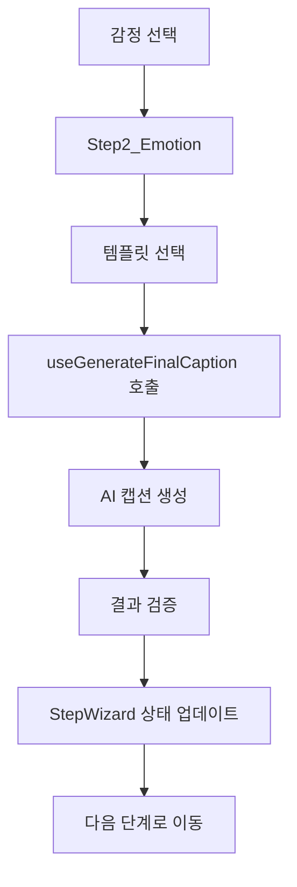
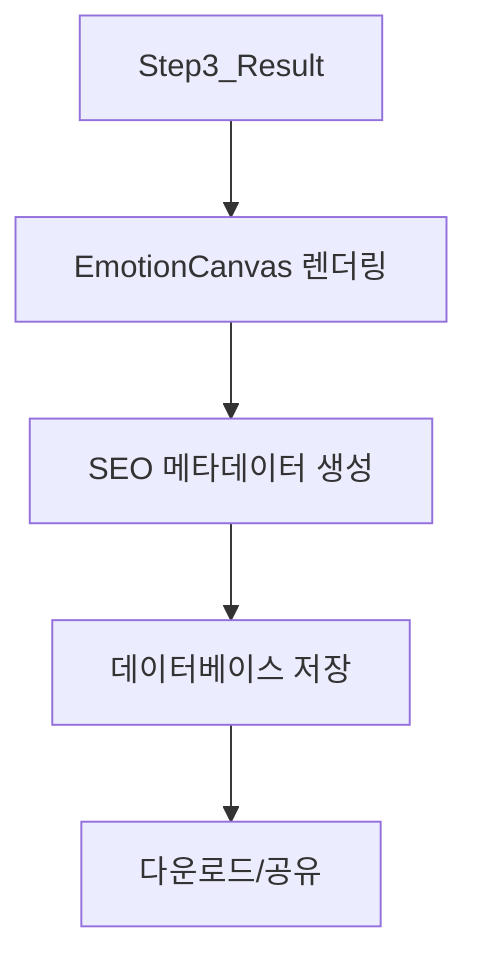

{
  "doc_meta": {
    "id": "STATE-001",
    "version": "2025-01-15",
    "owners": ["pablo"],
    "scope": ["frontend", "react", "state-management"],
    "status": "active",
    "related": ["COMP-001", "ARCH-001", "AI-001", "DB-001"]
  }
}

# StayPost 상태 관리 아키텍처

이 문서는 StayPost 프로젝트의 전역 상태 관리 구조와 데이터 플로우를 상세히 설명합니다. 다른 AI가 상태 변화를 추적하고 이해할 수 있도록 체계적으로 정리했습니다.

## 📋 목차
- [아키텍처 개요](#아키텍처-개요)
- [상태 관리 전략](#상태-관리-전략)
- [전역 상태 구조](#전역-상태-구조)
- [데이터 플로우](#데이터-플로우)
- [커스텀 훅](#커스텀-훅)
- [상태 변화 추적](#상태-변화-추적)
- [성능 최적화](#성능-최적화)
- [에러 처리](#에러-처리)
- [디버깅 가이드](#디버깅-가이드)

## 🏗️ 아키텍처 개요

### 전체 상태 관리 구조

```
StayPost 상태 관리 계층 구조
├── App Level (최상위)
│   ├── 인증 상태 (useAuth)
│   ├── 라우팅 상태 (React Router)
│   └── 전역 에러 상태
│
├── StepWizard Level (중앙 제어)
│   ├── 현재 단계 (step)
│   ├── 공유 데이터 (이미지, 캡션, 메타데이터)
│   ├── UI 상태 (로딩, 에러)
│   └── 네비게이션 상태
│
├── Step Level (단계별)
│   ├── Step1_Upload: 이미지 업로드 상태
│   ├── Step2_Emotion: 감정 선택 및 캡션 생성
│   └── Step3_Result: 결과 확인 및 다운로드
│
└── Component Level (로컬)
    ├── 폼 상태
    ├── UI 인터랙션 상태
    └── 임시 데이터
```

### 상태 관리 원칙

1. **단방향 데이터 플로우**: 부모 → 자식으로만 데이터 전달
2. **불변성 유지**: 상태 업데이트 시 새로운 객체 생성
3. **최소화**: 필요한 최소한의 상태만 유지
4. **예측 가능성**: 상태 변화가 명확하고 추적 가능
5. **성능 최적화**: 불필요한 리렌더링 방지

## 🎯 상태 관리 전략

### 1. 계층별 상태 분리

```typescript
// App Level - 인증 및 라우팅
const { user, loading, signIn, signOut } = useAuth();

// StepWizard Level - 전역 공유 상태
const [step, setStep] = useState(0);
const [uploadedImage, setUploadedImage] = useState<File | null>(null);
const [previewUrl, setPreviewUrl] = useState<string | null>(null);
const [imageDescription, setImageDescription] = useState<string>('');
const [selectedEmotion, setSelectedEmotion] = useState<string>('');
const [templateId, setTemplateId] = useState<string>('');
const [generatedCaption, setGeneratedCaption] = useState<string>('');
const [finalCaption, setFinalCaption] = useState<FinalCaptionResult | null>(null);
const [canvasUrl, setCanvasUrl] = useState<string>('');
const [cardId, setCardId] = useState<string | null>(null);
const [seoMeta, setSeoMeta] = useState<SeoMeta>({ title: '', keywords: [], hashtags: [], slug: '' });
const [storeSlug, setStoreSlug] = useState<string>('default');
const [hasExistingStore, setHasExistingStore] = useState<boolean>(false);
const [selectedPreset, setSelectedPreset] = useState<StylePreset>(getDefaultPreset());
const [analyzedStyleProfile, setAnalyzedStyleProfile] = useState<StyleProfile | null>(null);

// Step Level - 단계별 로컬 상태
const [isGenerating, setIsGenerating] = useState(false);
const [generationError, setGenerationError] = useState<string | null>(null);

// Component Level - UI 상태
const [showModal, setShowModal] = useState(false);
const [formData, setFormData] = useState({});
```

### 2. 상태 업데이트 패턴

```typescript
// 올바른 상태 업데이트 패턴
const updateFormData = (field: string, value: any) => {
  setFormData(prev => ({
    ...prev,           // 기존 상태 복사
    [field]: value     // 새로운 값으로 업데이트
  }));
};

// 배열 상태 업데이트
const addItem = (newItem: Item) => {
  setItems(prev => [...prev, newItem]);
};

// 객체 상태 업데이트
const updateUser = (updates: Partial<User>) => {
  setUser(prev => ({ ...prev, ...updates }));
};
```

## 📊 전역 상태 구조

### StepWizard 전역 상태

```typescript
interface StepWizardState {
  // 네비게이션
  step: number;
  
  // 이미지 관련
  uploadedImage: File | null;
  previewUrl: string | null;
  imageDescription: string;
  
  // 감정 및 스타일
  selectedEmotion: string;
  templateId: string;
  selectedPreset: StylePreset;
  analyzedStyleProfile: StyleProfile | null;
  
  // 캡션 관련
  generatedCaption: string;
  finalCaption: FinalCaptionResult | null;
  
  // 가게 관련
  storeSlug: string;
  hasExistingStore: boolean;
  
  // 결과 관련
  canvasUrl: string;
  cardId: string | null;
  seoMeta: {
    title: string;
    keywords: string[];
    hashtags: string[];
    slug: string;
  };
}
```

### 타입 정의

```typescript
// 스타일 프리셋
interface StylePreset {
  id: string;
  name: string;
  description: string;
  emotion: string;
  tone: string;
  context: string;
  rhythm: string;
  selfProjection: string;
}

// 스타일 프로필
interface StyleProfile {
  emotion: string;
  tone: string;
  context: string;
  rhythm: string;
  selfProjection: string;
}

// 최종 캡션 결과
interface FinalCaptionResult {
  hook: string;
  caption: string;
  hashtags: string[];
}

// SEO 메타데이터
interface SeoMeta {
  title: string;
  keywords: string[];
  hashtags: string[];
  slug: string;
}
```

## 🔄 데이터 플로우

### 1. 이미지 업로드 플로우



### 2. 캡션 생성 플로우



### 3. 결과 생성 플로우



## 🎣 커스텀 훅

### useAuth - 인증 상태 관리

```typescript
interface UseAuthReturn {
  user: User | null;
  session: Session | null;
  loading: boolean;
  signIn: () => Promise<void>;
  signOut: () => Promise<void>;
  checkAuthStatus: () => Promise<void>;
}

export function useAuth(): UseAuthReturn {
  const [user, setUser] = useState<User | null>(null);
  const [session, setSession] = useState<Session | null>(null);
  const [loading, setLoading] = useState(true);

  // 인증 상태 확인
  const checkAuthStatus = async () => {
    try {
      const { data: { session }, error } = await supabase.auth.getSession();
      if (error) throw error;
      
      setSession(session);
      setUser(session?.user ?? null);
    } catch (error) {
      console.error('Error checking auth status:', error);
    } finally {
      setLoading(false);
    }
  };

  // 로그인
  const signIn = async () => {
    try {
      const { error } = await supabase.auth.signInWithOAuth({
        provider: 'google',
        options: { redirectTo: window.location.origin }
      });
      if (error) throw error;
    } catch (error) {
      console.error('Error signing in:', error);
      throw error;
    }
  };

  // 로그아웃
  const signOut = async () => {
    try {
      const { error } = await supabase.auth.signOut();
      if (error) throw error;
      
      setUser(null);
      setSession(null);
    } catch (error) {
      console.error('Error signing out:', error);
      throw error;
    }
  };

  // 인증 상태 모니터링
  useEffect(() => {
    checkAuthStatus();
    
    const { data: { subscription } } = supabase.auth.onAuthStateChange(
      async (event, session) => {
        setSession(session);
        setUser(session?.user ?? null);
        setLoading(false);
      }
    );

    return () => subscription.unsubscribe();
  }, []);

  return { user, session, loading, signIn, signOut, checkAuthStatus };
}
```

### useGenerateFinalCaption - 캡션 생성

```typescript
interface UseGenerateFinalCaptionReturn {
  finalCaption: FinalCaptionResult | null;
  loading: boolean;
  error: string | null;
  generate: (imageUrl: string, styleProfile: StyleProfile) => Promise<void>;
}

export default function useGenerateFinalCaption(): UseGenerateFinalCaptionReturn {
  const [finalCaption, setFinalCaption] = useState<FinalCaptionResult | null>(null);
  const [loading, setLoading] = useState<boolean>(false);
  const [error, setError] = useState<string | null>(null);

  const generate = async (imageUrl: string, styleProfile: StyleProfile): Promise<void> => {
    if (!imageUrl || !styleProfile) {
      setError('Image URL and style profile are required');
      return;
    }

    setLoading(true);
    setError(null);

    try {
      const { data, error } = await invokeSupabaseFunction('generate-final-caption', {
        method: 'POST',
        body: { 
          image_url: imageUrl,
          style_profile: styleProfile
        },
      });

      if (error) throw new Error(error.message || 'Failed to generate final caption');
      if (!data) throw new Error('No response data received from the server');

      // 필수 필드 검증
      if (!data.hook || !data.caption || !data.hashtags) {
        throw new Error('Incomplete caption data received from the server');
      }

      const result: FinalCaptionResult = {
        hook: String(data.hook),
        caption: String(data.caption),
        hashtags: Array.isArray(data.hashtags) 
          ? data.hashtags.map((tag: any) => String(tag))
          : []
      };

      setFinalCaption(result);
    } catch (err: any) {
      console.error('❌ 최종 캡션 생성 에러:', err);
      setError(err instanceof Error ? err.message : 'An unexpected error occurred');
      setFinalCaption(null);
    } finally {
      setLoading(false);
    }
  };

  return { finalCaption, loading, error, generate };
}
```

### useGenerateImageMeta - 이미지 메타데이터 생성

```typescript
interface UseGenerateImageMetaReturn {
  imageMeta: any;
  loading: boolean;
  error: string | null;
  generate: (caption: string) => Promise<void>;
}

export default function useGenerateImageMeta(): UseGenerateImageMetaReturn {
  const [imageMeta, setImageMeta] = useState<any>(null);
  const [loading, setLoading] = useState<boolean>(false);
  const [error, setError] = useState<string | null>(null);

  const generate = async (caption: string): Promise<void> => {
    if (!caption) {
      setError('Caption is required');
      return;
    }

    setLoading(true);
    setError(null);

    try {
      const { data, error } = await invokeSupabaseFunction('generate-image-meta', {
        method: 'POST',
        body: { caption },
      });

      if (error) throw new Error(error.message || 'Failed to generate image meta');
      if (!data) throw new Error('No response data received from the server');

      setImageMeta(data);
    } catch (err: any) {
      console.error('❌ 이미지 메타데이터 생성 에러:', err);
      setError(err instanceof Error ? err.message : 'An unexpected error occurred');
      setImageMeta(null);
    } finally {
      setLoading(false);
    }
  };

  return { imageMeta, loading, error, generate };
}
```

### useAnalyzeStyle - 스타일 분석

```typescript
export interface StyleProfile {
  emotion: string;
  tone: string;
  context: string;
  rhythm: string;
  selfProjection: string;
}

interface UseAnalyzeStyleReturn {
  styleProfile: StyleProfile | null;
  loading: boolean;
  error: string | null;
  analyze: (imageUrl: string) => Promise<void>;
}

export default function useAnalyzeStyle(): UseAnalyzeStyleReturn {
  const [styleProfile, setStyleProfile] = useState<StyleProfile | null>(null);
  const [loading, setLoading] = useState<boolean>(false);
  const [error, setError] = useState<string | null>(null);

  const analyze = async (imageUrl: string): Promise<void> => {
    if (!imageUrl) {
      setError('Image URL is required');
      return;
    }

    setLoading(true);
    setError(null);

    try {
      const { data, error } = await invokeSupabaseFunction('analyze-and-suggest-style', {
        method: 'POST',
        body: { image_url: imageUrl },
      });

      if (error) throw new Error(error.message || 'Failed to analyze style');
      if (!data) throw new Error('No response data received from the server');

      setStyleProfile(data);
    } catch (err: any) {
      console.error('❌ 스타일 분석 에러:', err);
      setError(err instanceof Error ? err.message : 'An unexpected error occurred');
      setStyleProfile(null);
    } finally {
      setLoading(false);
    }
  };

  return { styleProfile, loading, error, analyze };
}
```

### useGenerateStayPostContent - 전체 콘텐츠 생성

```typescript
interface UseGenerateStayPostContentReturn {
  content: any;
  loading: boolean;
  error: string | null;
  generate: (params: GenerateParams) => Promise<void>;
}

interface GenerateParams {
  imageUrl: string;
  emotion: string;
  templateId: string;
  imageDescription?: string;
  styleProfile?: StyleProfile;
}

export default function useGenerateStayPostContent(): UseGenerateStayPostContentReturn {
  const [content, setContent] = useState<any>(null);
  const [loading, setLoading] = useState<boolean>(false);
  const [error, setError] = useState<string | null>(null);

  const generate = async (params: GenerateParams): Promise<void> => {
    const { imageUrl, emotion, templateId, imageDescription, styleProfile } = params;

    if (!imageUrl || !emotion || !templateId) {
      setError('Image URL, emotion, and template ID are required');
      return;
    }

    setLoading(true);
    setError(null);

    try {
      // 복잡한 콘텐츠 생성 로직
      const result = await generateStayPostContent(params);
      setContent(result);
    } catch (err: any) {
      console.error('❌ StayPost 콘텐츠 생성 에러:', err);
      setError(err instanceof Error ? err.message : 'An unexpected error occurred');
      setContent(null);
    } finally {
      setLoading(false);
    }
  };

  return { content, loading, error, generate };
}
```

## 📈 상태 변화 추적

### 디버그 로깅

```typescript
// 상태 변화 추적을 위한 디버그 로깅
useEffect(() => {
  console.log('🔄 StepWizard 상태 변화:', {
    step,
    uploadedImage: uploadedImage?.name,
    selectedEmotion,
    generatedCaption: generatedCaption?.substring(0, 50),
    storeSlug
  });
}, [step, uploadedImage, selectedEmotion, generatedCaption, storeSlug]);

// 에러 상태 추적
useEffect(() => {
  if (error) {
    console.error('❌ 에러 발생:', error);
  }
}, [error]);
```

### 상태 변화 이벤트

```typescript
// 상태 변화 이벤트 추적
const handleStateChange = (field: string, value: any) => {
  console.log(`📊 상태 변화: ${field}`, value);
  
  // 상태 업데이트
  switch (field) {
    case 'step':
      setStep(value);
      break;
    case 'uploadedImage':
      setUploadedImage(value);
      break;
    // ... 기타 필드들
  }
};
```

## ⚡ 성능 최적화

### 1. 메모이제이션

```typescript
// 컴포넌트 메모이제이션
const MemoizedStep = React.memo(StepComponent);

// 계산 결과 메모이제이션
const expensiveCalculation = useMemo(() => {
  return computeExpensiveValue(dependencies);
}, [dependencies]);

// 콜백 메모이제이션
const handleClick = useCallback(() => {
  // 클릭 핸들러 로직
}, [dependencies]);
```

### 2. 상태 업데이트 최적화

```typescript
// 배치 상태 업데이트
const updateMultipleStates = () => {
  ReactDOM.flushSync(() => {
    setState1(newValue1);
    setState2(newValue2);
    setState3(newValue3);
  });
};

// 조건부 상태 업데이트
const updateStateIfNeeded = (newValue: any) => {
  setState(prev => {
    if (prev === newValue) return prev;
    return newValue;
  });
};
```

### 3. 불필요한 리렌더링 방지

```typescript
// 객체 참조 최적화
const memoizedObject = useMemo(() => ({
  prop1: value1,
  prop2: value2
}), [value1, value2]);

// 배열 참조 최적화
const memoizedArray = useMemo(() => [
  item1,
  item2,
  item3
], [item1, item2, item3]);
```

## 🚨 에러 처리

### 1. 에러 바운더리

```typescript
class ErrorBoundary extends React.Component {
  constructor(props) {
    super(props);
    this.state = { hasError: false, error: null };
  }

  static getDerivedStateFromError(error) {
    return { hasError: true, error };
  }

  componentDidCatch(error, errorInfo) {
    console.error('Error caught by boundary:', error, errorInfo);
  }

  render() {
    if (this.state.hasError) {
      return <ErrorFallback error={this.state.error} />;
    }

    return this.props.children;
  }
}
```

### 2. 훅 레벨 에러 처리

```typescript
// 훅에서의 에러 처리
const useCustomHook = () => {
  const [error, setError] = useState<string | null>(null);

  const handleError = (err: any) => {
    console.error('Hook error:', err);
    setError(err instanceof Error ? err.message : 'An unexpected error occurred');
  };

  const safeOperation = async (operation: () => Promise<any>) => {
    try {
      setError(null);
      return await operation();
    } catch (err) {
      handleError(err);
      throw err;
    }
  };

  return { error, safeOperation };
};
```

### 3. 컴포넌트 레벨 에러 처리

```typescript
// 컴포넌트에서의 에러 처리
const ComponentWithErrorHandling = () => {
  const [error, setError] = useState<string | null>(null);

  const handleAsyncOperation = async () => {
    try {
      setError(null);
      // 비동기 작업
      await someAsyncOperation();
    } catch (err) {
      console.error('Component error:', err);
      setError(err instanceof Error ? err.message : 'An error occurred');
    }
  };

  if (error) {
    return <ErrorMessage message={error} onRetry={handleAsyncOperation} />;
  }

  return <div>Component content</div>;
};
```

## 🔍 디버깅 가이드

### 1. 상태 디버깅

```typescript
// 상태 변화 추적
const useDebugState = (state: any, label: string) => {
  useEffect(() => {
    console.log(`🔍 ${label} 상태 변화:`, state);
  }, [state, label]);
};

// 컴포넌트에서 사용
const MyComponent = () => {
  const [count, setCount] = useState(0);
  useDebugState(count, 'Count');
  
  return <button onClick={() => setCount(c => c + 1)}>{count}</button>;
};
```

### 2. 성능 디버깅

```typescript
// 렌더링 성능 측정
const useRenderCount = (componentName: string) => {
  const renderCount = useRef(0);
  
  useEffect(() => {
    renderCount.current += 1;
    console.log(`🔄 ${componentName} 렌더링 횟수:`, renderCount.current);
  });
};

// 메모리 사용량 추적
const useMemoryUsage = () => {
  useEffect(() => {
    if ('memory' in performance) {
      const memory = (performance as any).memory;
      console.log('💾 메모리 사용량:', {
        used: Math.round(memory.usedJSHeapSize / 1048576) + ' MB',
        total: Math.round(memory.totalJSHeapSize / 1048576) + ' MB',
        limit: Math.round(memory.jsHeapSizeLimit / 1048576) + ' MB'
      });
    }
  });
};
```

### 3. 네트워크 디버깅

```typescript
// API 호출 추적
const useApiDebug = () => {
  const logApiCall = (endpoint: string, params: any, response: any) => {
    console.log('🌐 API 호출:', {
      endpoint,
      params,
      response: response?.data || response,
      timestamp: new Date().toISOString()
    });
  };

  return { logApiCall };
};
```

## 📋 모범 사례

### 1. 상태 설계 원칙

- **단일 진실 공급원**: 각 데이터는 하나의 소스에서만 관리
- **정규화**: 중복 데이터 제거 및 참조 관계 최적화
- **불변성**: 상태 업데이트 시 새로운 객체 생성
- **예측 가능성**: 상태 변화가 명확하고 추적 가능

### 2. 성능 최적화 원칙

- **메모이제이션**: 비용이 큰 계산 결과 캐싱
- **지연 로딩**: 필요할 때만 데이터 로드
- **배치 업데이트**: 여러 상태 업데이트를 한 번에 처리
- **불필요한 리렌더링 방지**: React.memo, useMemo, useCallback 활용

### 3. 에러 처리 원칙

- **방어적 프로그래밍**: 예상치 못한 상황에 대비
- **사용자 친화적 에러 메시지**: 기술적 세부사항 숨기기
- **복구 메커니즘**: 에러 발생 시 자동 복구 시도
- **로깅**: 디버깅을 위한 상세한 에러 로그

## 🏛️ ADR (Architecture Decision Records)

### ADR-001: React Hooks 기반 상태 관리
**날짜**: 2025-01-15  
**상태**: 승인됨  
**컨텍스트**: 복잡한 상태 관리 요구사항에 대한 솔루션 선택  
**결정**: React Hooks와 커스텀 훅을 사용한 상태 관리  
**결과**: 코드 재사용성 향상 및 테스트 용이성 개선

### ADR-002: 계층별 상태 분리
**날짜**: 2025-01-15  
**상태**: 승인됨  
**컨텍스트**: 복잡한 애플리케이션의 상태 관리 구조 설계  
**결정**: App, StepWizard, Step, Component 레벨로 상태 분리  
**결과**: 상태 관리 복잡도 감소 및 유지보수성 향상

### ADR-003: 단방향 데이터 플로우
**날짜**: 2025-01-15  
**상태**: 승인됨  
**컨텍스트**: 데이터 흐름의 예측 가능성과 디버깅 용이성 확보  
**결정**: 부모에서 자식으로만 데이터 전달하는 단방향 플로우 채택  
**결과**: 상태 변화 추적 용이성 및 버그 발생 가능성 감소

## 📋 Changelog

| 날짜 | 버전 | 요약 |
|------|------|------|
| 2025-01-15 | v1.0.0 | 상태 관리 아키텍처 문서 초기 작성 |
| 2025-01-15 | v1.1.0 | 커스텀 훅 상세 설명 추가 |
| 2025-01-15 | v1.2.0 | 성능 최적화 및 에러 처리 가이드 추가 |
| 2025-01-15 | v2.0.0 | 실제 코드 분석 기반 완전 재작성 |
| 2025-01-15 | v2.1.0 | 문서 동기화 및 최신 변경사항 반영 |
